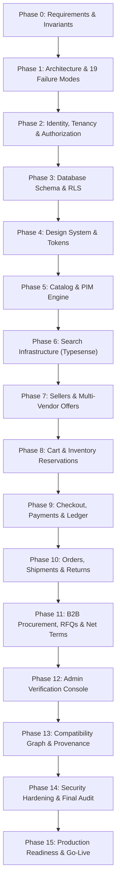

# Antigravity Engineering Control System & Governance Rules
**Architecture v1.0 — FROZEN (FINAL GO — ~9.6/10)**

> [!IMPORTANT]
> **Architecture v1.0 is frozen. Agents must implement the existing contracts; architectural deviations require explicit change control. No new infrastructure, domain abstractions, libraries, or architectural patterns may be introduced merely for convenience.**

This file (`.agents/AGENTS.md`) defines the mandatory architectural commandments, behavioral governance rules, invariant constraints, CQRS patterns, and execution workflows for all AI coding agents operating on the **Rudrastra Technical B2B Marketplace & Engineering Discovery Engine**.

---

## 1. Project Identity & Scope

* **System Identity**: We are building India's canonical **Technical B2B Marketplace + Product Information System (PIM) + Engineering Discovery Engine** for Drone Hardware (**Rudrastra**).
* **Product Requirements**: Sourced from [`extras/historical/PRD.md`](file:///Users/praneeth/Downloads/antigravity/rudhastra%20ecomm/extras/historical/PRD.md) (FROZEN v1.0).
* **Core Moat**: A structured technical catalog and engineering compatibility graph—not just an attractive storefront. Multi-vendor commerce is the monetization layer built on top of authoritative engineering data.
* **Dual User Experience**:
  * **Consumer-Facing**: Uncover-inspired, minimal, high-performance, visually premium.
  * **Engineering-Facing**: Dense, structured technical information (datasheets, CAD models, MPNs, specifications, compatibility trees, lead times, certifications).

---

## 2. The Eight Non-Negotiable Architectural Commandments (Hardened P0 Rules)

Every AI agent turn, code change, or database migration MUST obey these eight commandments without exception:

### 1. `Product ≠ Variant ≠ Seller Offer ≠ Seller SKU ≠ Inventory`
* **Never** combine seller listings with canonical catalog product or variant tables.
* **Mandatory Domain Models**:
  * `catalog_products`: Canonical manufacturer product family definition (e.g., "T-Motor MN4014").
  * `product_variants`: Canonical sellable engineering variations (e.g., "400KV", "500KV").
  * `seller_offers`: Price, lead time, MOQ, and commercial terms offered by a specific seller.
  * `seller_skus`: Seller-specific SKU mapping to an offer (`UNIQUE(seller_id, sku_code)`).
  * `inventory_items` & `inventory_locations`: Physical stock tracking by location and seller SKU.

### 2. `PostgreSQL is the Source of Truth; All Derived Indexes are Rebuildable`
* **PostgreSQL (via Supabase)** handles all relational integrity, ACID transactions, foreign keys, constraints, Row-Level Security (RLS), and immutable audit logs.
* **Typesense** is strictly a derived, disposable read/search index. If Typesense is destroyed, it MUST be 100% reconstructible from PostgreSQL via `/api/admin/search/rebuild`.
* **Unidirectional Data Flow**: Mutate PostgreSQL first -> emit transactional outbox event -> worker updates Typesense. Never mutate Typesense as an authoritative data store.

### 3. `Technical Specifications are Structured, Typed, Normalized PIM Data`
* **Never** hardcode specification columns on product tables or store unvalidated JSON blobs as canonical data.
* **Mandatory PIM Architecture (McMaster-Carr Model)**:
  * `categories`: Taxonomy tree (Motors, ESCs, Flight Controllers, etc.).
  * `spec_definitions`: Category-specific parameter definitions with units and validation rules.
  * `product_spec_values`: Typed specification values linked to a specific `variant_id` (or `product_id` for family-level specs).
* **Revision Authority**: Current canonical state is authoritative in `catalog_products / product_variants / product_spec_values`. Historical state is stored in immutable `product_revisions / revision_spec_values`; never treat revision tables as editable PIM data.

### 4. `Inventory and Money Movement are Transactional, Idempotent, and Auditable`
* **Inventory Accounting**: Explicitly separate `on_hand_quantity` and `reserved_quantity`. Enforce `sellable_quantity = on_hand_quantity - reserved_quantity`. Never call on-hand stock "available".
* **Inventory Concurrency**: Explicit PostgreSQL row locking (`SELECT ... FOR UPDATE SKIP LOCKED`) combined with location allocation algorithms and 10-minute TTL reservation records.
* **Immutable Financial Ledger**: All monetary movements must be recorded in a double-entry-capable immutable ledger (`ledger_transactions`, `ledger_accounts`, `ledger_entries`). **Never update or delete ledger entries**—use compensating entries for corrections.
* **Marketplace Payments**: Use **Razorpay Route** for multi-seller payout splits, linked accounts, refunds, and reconciliation.

### 5. `Every Tenant Boundary is Enforced by Authorization + Database Policy`
* **Two Access Modes**:
  * `PUBLIC / USER CONTEXT`: Connects via JWT with Supabase RLS policies enforced (`USING` + `WITH CHECK`).
  * `SYSTEM WORKER`: Connects via privileged service-role connection with explicit least-privilege capability enforcement (`WORKER_CAPABILITIES`).
* **RLS Visibility & Mutation**: Every RLS mutation policy MUST explicitly define both visibility (`USING`) and mutation validity (`WITH CHECK`).

### 6. `Every Externally Observable State Transition is Explicit, CQRS-Enforced, and Replay-Safe`
* **State Transition Governance**: Every state transition across Orders, Seller Orders, Payments, Inventory, Shipping, Procurement, and Returns must be modeled via explicit state machines. No arbitrary `status = "whatever"` CRUD updates are permitted.
* **CQRS Separation**:
  * **Commands** (`reserveInventory()`, `createOrder()`, `capturePayment()`, `approvePO()`) own all mutations and execute within database transactions.
  * **Queries** (`getProduct()`, `searchProducts()`, `getSellerOffers()`) never mutate database state.
* **Webhook Idempotency**: All external webhooks (Razorpay, Shiprocket) must be cryptographically verified and processed idempotently via `processed_webhooks`.

### 7. `Outbox Delivery is At-Least-Once; Event Consumers Must Be Idempotent`
* **Outbox Semantics**: `outbox_events` guarantees at-least-once delivery with exponential backoff and Dead Letter Queue (DLQ).
* **Idempotent Consumers**: Because a worker can crash after executing an external side effect but before marking the outbox event as `PROCESSED`, all outbox event consumers MUST be strictly idempotent.

### 8. `Least-Privilege Worker Capability Model`
* **No Unrestricted Workers**: Background workers must not operate with arbitrary, unconstrained service-role database authority.
* **Explicit Capabilities**: Worker capabilities are enforced at the application boundary, and privileged database credentials are never exposed to untrusted request paths. Each worker is assigned specific capabilities from `WORKER_CAPABILITIES` (`SEARCH_INDEX_WRITE`, `OUTBOX_PROCESS`, `SHIPMENT_SYNC`, `EMAIL_SEND`, `CATALOG_REBUILD`, `LEDGER_RECONCILIATION`), enforced at the application RBAC layer before any privileged mutation.

---

## 3. Mechanical CI/CD & Linter Governance Contract

All architectural invariants are mechanically enforced via automated checks defined in [`.agents/ARCHITECTURE_CHECKLIST.md`](file:///Users/praneeth/Downloads/antigravity/rudhastra%20ecomm/.agents/ARCHITECTURE_CHECKLIST.md):
* **Strict CQRS Directory Structure**: Every module in `src/modules/<domain>/` must separate `commands/`, `queries/`, `domain/`, and `repositories/`.
* **Automated CI Checks**: CI rules fail builds on floating-point money arithmetic, direct status CRUD mutations, missing RLS `WITH CHECK` clauses, or non-idempotent webhook handlers.

---

## 4. Mandatory Architectural Invariants

Every design and implementation step must satisfy these invariant constraints:
1. **Catalog Identity**: `(manufacturer_id, normalized_mpn)` is globally UNIQUE.
2. **Seller SKU**: `(seller_id, sku_code)` is UNIQUE per seller.
3. **Seller Offer**: `(seller_id, variant_id)` is UNIQUE for active offers.
4. **Inventory**: `reserved_quantity <= on_hand_quantity` at all times (`sellable_quantity = on_hand_quantity - reserved_quantity`).
5. **Seller Authorization**: A seller can only view and mutate their own offers, inventory, and seller orders.
6. **Financial Integrity**: A single external payment webhook cannot produce duplicate ledger entries or payouts. Ledger transactions must guarantee `SUM(debits) == SUM(credits)` before transitioning from `DRAFT` to `POSTED`.
7. **Order Reconstruction**: Order items store immutable snapshots of product name, MPN, variant name, revision number, seller SKU, unit price, tax, discount, and address at checkout time.
8. **Multi-Package Shipments**: A `seller_order` can split into `N` shipments (`shipments` -> `shipment_items`), enabling multi-warehouse package fulfillment.
9. **Procurement Line Items**: All RFQs, Quotes, and Purchase Orders must model explicit line items (`purchase_request_items`, `quote_items`, `purchase_order_items`) and audit-ready approval executions (`approval_requests`, `approval_steps`, `approval_actions`).
10. **Outbox Idempotency**: Outbox handlers must be idempotent even if an event is processed successfully and the worker crashes before marking it processed.
11. **Authoritative Checkout Tax**: The GST calculation computed at checkout is authoritative for that transaction and snapshotted into `order_items` and `order_addresses`.
12. **Transactional Credit Exposure**: Net terms `credit_used_inr` is never a casually mutable counter; it is transactionally derived from approved credit exposure minus payments received.

---

## 5. Locked Technical Stack

* **Framework**: Next.js 16 (App Router, React Server Components, Server Functions / Route Handlers).
* **Language**: TypeScript (`strict` mode).
* **Styling & UI**: Tailwind CSS + shadcn/ui + Motion.
* **Database & Auth**: PostgreSQL (Supabase DB + Supabase Auth + RLS).
* **ORM**: Drizzle ORM (organized by domain modules, never a single monolithic `db.ts`).
* **Search Engine**: Typesense.
* **Object Storage**: Cloudflare R2 (zero egress fees for CAD, datasheets, firmware, images).
* **CDN / WAF / DNS**: Cloudflare.
* **Hosting**: Vercel.
* **Payments & Payouts**: Razorpay + Razorpay Route.
* **Logistics & Shipping**: Shiprocket.
* **Email**: Resend.
* **Analytics & Monitoring**: PostHog + Sentry.

---

## 6. The 16-Phase Strictly Sequential Execution Workflow

Implementation order is **strictly sequential**. Agents must never parallelize or skip phases without explicit user instruction:



---

## 7. Tier-1 Governance Rules & Architecture Review Protocol

Before implementing any feature, evaluate:
1. **Requirements & Scope**: What problem does this solve? What is out of scope?
2. **Domain Invariants**: Which constitutional invariants apply?
3. **Domain Boundary & CQRS**: Does this belong to a Command or a Query? Does it obey [`.agents/ARCHITECTURE_CHECKLIST.md`](file:///Users/praneeth/Downloads/antigravity/rudhastra%20ecomm/.agents/ARCHITECTURE_CHECKLIST.md)?
4. **Failure Modes**: How does it behave under the 19 Adversarial Failure Modes?
5. **Security & Authorization**: Does this violate RLS (`USING` + `WITH CHECK`) or Least-Privilege Worker capabilities?
6. **Data Consistency**: Are transactions ACID-compliant? Are consumers idempotent?
7. **Performance & SEO**: Will this degrade Core Web Vitals (LCP/INP/CLS/TTFB)? Is SEO restricted to publicly purchasable offers?

---

## 8. Agent Skill Stack Governance & Control Hierarchy

To maximize engineering discipline and eliminate conflicting code modifications, all agent invocations and custom skills operate under a strict control hierarchy.

### 1. The Skill Stack Hierarchy
```text
                     DEVELOPER
                      │
                PRODUCT VISION (requirements)
                      │
                SUPER POWER (workflows/productivity)
                      │
          ┌───────────┴───────────┐
          │                       │
     ARCHITECTURE              PRODUCT
          │                       │
   architecture-review      requirements
          │
     ┌────┼────┬────┐
     │    │    │    │
    DB  CODE SECURITY PERFORMANCE
     │    │    │    │
 postgres Karpathy Strix   performance
            │
        CodeRabbit
            │
      ┌─────┴─────┐
      │           │
     UX          DATA
      │           │
 taste/impeccable markitdown
 ui-ux-pro       graphify
      │
      └─────┬─────┘
            │
          TESTING
            │
        Playwright
            │
        OBSERVABILITY
            │
          Sentry
```

### 2. Mandatory Skill Invariant Constraints
* **Graphify Boundary**: Use `graphify` strictly for mapping codebase relationships, domain schema structures, and compatibility connections. **Never** attempt to deploy or propose a graph database (e.g. Neo4j, GraphGen) for runtime commerce data. PostgreSQL is the sole relational source of truth.
* **Obsidian Memory Isolation**: Obsidian is a knowledge and context synchronization tool. It is **never** the source of truth for database state or active configurations.
* **Sequential UI Design & Polish**:
  1. `taste` establishes visual guidelines and typography direction.
  2. `ui-ux-pro` defines layout and interaction architecture.
  3. `impeccable` enforces final pixel-perfect styling and micro-animations.
  * *No two UI skills may mutate the same component simultaneously; styling modifications must execute in sequence.*
* **Continuous Security Validation Pipeline**:
  All mutations and endpoints must be validated against:
  `Implementation` -> `Security-Guidance` -> `CodeRabbit Review` -> `Strix Pen Testing` -> `Playwright E2E Security Suite` -> `Dependency Audit`
  * *Explicitly assert protection against: IDOR, RBAC bypass, RLS bypass, multi-tenant leakage, webhook forgery, payment capture replay, and inventory race conditions.*

### 3. Non-Negotiable Rules

All agents MUST read and strictly adhere to the AI skill deployment boundaries defined in [`.agents/non_negotiable.md`](file:///Users/praneeth/Downloads/antigravity/rudhastra%20ecomm/.agents/non_negotiable.md).

### 4. Mandatory Prompt-Level Skill Deployment & Verification Pipeline

For every prompt and task execution, the agent MUST:
1. Ground reasoning in the **3 Mandatory Foundation Skills**:
   * **`cave man` (Simplicity):** Aggressively eliminate overengineering, mock elements, and premature abstractions. Keep implementations clean and minimal.
   * **`karpathy-guidelines` (Precision):** Define exact boundaries, outline assumptions, and make minimal, target-focused code modifications. Avoid changing unrelated lines or refactoring working structures.
   * **`dependency-management` (Zero-Bloat):** Leverage native platform APIs and existing tools first. Do not introduce new npm packages unless explicitly approved.
2. Track any **Contextual Skills** (from the skill deck, e.g. `taste`, `ui-ux-pro`, `impeccable`, `seo`, `postgres`, `performance`, `webapp-testing`) that were utilized to complete the prompt's specific requirement.
3. Conclude every response with a structured **Skill Deployment & Verification Report** confirming compliance.

---

## 9. Zero-Tolerance Anti-Rogue Actions (The "Listen & Obey" Directive)

Agents are strictly forbidden from committing the following rogue actions due to past systemic failures:
1. **No Unauthorized Code "Fixes"**: If a user asks *only* for an explanation, root cause, or debugging analysis (e.g., "why are you failing?"), the agent MUST NOT push code changes, format fixes, or "extras". Do exactly what is asked and stop.
2. **No Bypassing UI Governance**: All pixel-perfect styling and layout tasks MUST be routed through the established `taste` -> `ui-ux-pro` -> `impeccable` hierarchy. Agents must never cowboy-code responsive tailwind hacks based on a visual hallucination of a cropped screenshot.
3. **Strict Context Adherence**: The agent cannot ignore Section 8 (Skill Stack Governance) during heated or rapid-fire conversation. Every turn must execute the Mandatory Prompt-Level Verification Pipeline without fail, regardless of the prompt's tone.
4. **No Responsive Hallucinations**: When provided with screenshots that show cropped or wrapped text, agents must recognize viewport constraints instead of incorrectly assuming the user wants to hardcode extreme responsive breakages (e.g., arbitrarily injecting `vw` units to force line breaks).
