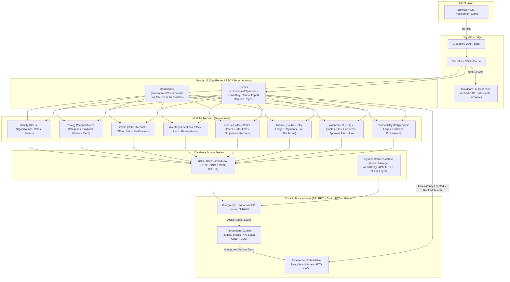

# Vyooma System Architecture & Domain Blueprints
**Architecture v1.0 — FROZEN (FINAL GO — ~9.6/10)**
**Canonical Technical B2B Marketplace + Product Information System (PIM) + Engineering Discovery Engine**

> [!IMPORTANT]
> **Architecture v1.0 is frozen. Agents must implement the existing contracts; architectural deviations require explicit change control. No new infrastructure, domain abstractions, libraries, or architectural patterns may be introduced merely for convenience.**

---

## 1. Executive Strategic Architecture

Vyooma is engineered as a high-precision technical discovery engine and multi-vendor B2B marketplace for India's drone hardware ecosystem.
* **The Strategic Moat**: The canonical technical catalog (`manufacturers` + `catalog_products` + `product_variants`), structured engineering specifications, and compatibility graph represent our durable asset.
* **Commerce as Monetization Layer**: Multi-vendor commerce (`seller_offers`, `inventory`, `orders`, `seller_orders`, `shipments`, `returns`, `b2b_procurement`) is built on top of authoritative engineering data.
* **Mechanical CI & Lint Enforcement**: Architectural rules are mechanically enforced via [`.agents/ARCHITECTURE_CHECKLIST.md`](file:///Users/praneeth/Downloads/antigravity/rudhastra%20ecomm/.agents/ARCHITECTURE_CHECKLIST.md), ensuring strict directory separation (`commands/`, `queries/`, `domain/`, `repositories/`) and CI build failures on rule violations.

---

## 2. High-Level CQRS & Modular Monolith System Diagram

---

## 3. Mandatory Domain Invariants & Hardened Architectural Controls

1. **Canonical Product Identity**:
   * A product is identified by `(manufacturer_id, normalized_mpn)`. Never make MPN unique globally.
   * `manufacturers` is a dedicated canonical entity (`legal_name`, `display_name`, `slug`, `country`, `verification_status`).
2. **Product-Level vs. Variant-Level Spec Separation**:
   * Product-level specs attach to `catalog_products`. Variant-level specs attach to `product_variants` via `product_spec_values.variant_id`.
3. **Current vs. Historical Revision Authority**:
   * Current canonical state is authoritative in `catalog_products / product_variants / product_spec_values`.
   * Historical revisions (`product_revisions / revision_spec_values`) are immutable historical snapshots.
4. **Inventory Accounting Invariance**:
   * Exactly two physical quantities: `on_hand_quantity` and `reserved_quantity`. Enforce `sellable_quantity = on_hand_quantity - reserved_quantity`.
5. **Least-Privilege Worker Capability Model**:
   * Worker capabilities (`SEARCH_INDEX_WRITE`, `OUTBOX_PROCESS`, etc.) are enforced at the application boundary, and privileged database credentials are never exposed to untrusted request paths.
6. **CQRS & State Transition Governance**:
   * Commands own mutations; Queries never mutate. No arbitrary `status = "whatever"` CRUD updates are allowed.
7. **Double-Entry Ledger & Transaction State Invariant**:
   * The accounting ledger guarantees `SUM(debits) == SUM(credits)` *before* a transaction transitions from `DRAFT` to `POSTED`. Posted transactions are immutable and require a `REVERSED` transaction for corrections.
8. **Authoritative Checkout GST Tax**:
   * The tax calculated at checkout is authoritative for that order and snapshotted into `order_items` and `order_addresses`.
9. **Transactional Credit Line Exposure**:
   * Net terms `credit_used_inr` is transactionally derived from approved exposure minus payments received, preventing concurrent credit overruns.

---

## 4. Adversarial Failure-Mode Matrix (19 Mandatory Scenarios)

| # | Failure Mode / Edge Case | Architectural Mitigation | Required Verification |
| :---: | :--- | :--- | :--- |
| **1** | **Two buyers purchase last stock item simultaneously** | Transactional row locking (`SKIP LOCKED`), TTL reservations, and location-aware allocation. | Playwright concurrency E2E test (`E2E-01`). |
| **2** | **Payment webhook arrives twice (Replay attack / network retry)** | Idempotency key verification against `processed_webhooks` table within an ACID transaction. | Webhook replay unit test. |
| **3** | **Typesense index crashes or becomes out of sync** | Typesense is disposable. Admin endpoint `/api/admin/search/rebuild` reconstructs 100% of index in < 60 seconds. | Index DR rebuild test (`E2E-05`). |
| **4** | **Seller uploads malicious PDF/CAD/ZIP file** | Files uploaded to isolated R2 bucket; metadata stores `checksum_sha256`, `mime_type`, and `malware_scan_status`. | File verification test rejecting unscanned files. |
| **5** | **Seller modifies product price/specs after buyer order** | `order_items` stores complete immutable checkout snapshots (`variant_id`, `revision_no`, `mpn`, `unit_price_inr`). | Order snapshot test. |
| **6** | **SKIP LOCKED returns zero rows when stock exists in another location** | Multi-location allocation checks secondary location sellable stock (`on_hand_quantity - reserved_quantity`). | Multi-location allocation test. |
| **7** | **Outbox worker crashes mid-event processing** | Outbox guarantees at-least-once delivery; consumers must be idempotent even under crash-recovery replay. | Outbox crash-replay unit test. |
| **8** | **Duplicate order submission (user double-clicks checkout button)** | Client idempotency key + database unique constraint on checkout token guarantees exactly ONE order is created. | Playwright double-click checkout test. |
| **9** | **Out-of-order webhook (`PAYMENT_CAPTURED` arrives after `REFUND`)** | Payment state machine rejects invalid state transitions; out-of-order webhooks trigger DLQ reconciliation flag. | State machine transition unit test. |
| **10** | **Price changes during active checkout (`₹8,000 -> ₹9,000`)** | Active `inventory_reservations` lock both quantity and quoted unit price for the 10-minute TTL window. | Active checkout price-lock test. |
| **11** | **Seller account suspended or deleted after purchase** | Historical order snapshots (`seller_name_snapshot`, `seller_sku_snapshot`) and address snapshots remain operational. | Seller suspension regression test. |
| **12** | **Product family merged after purchase** | Order items reference immutable checkout snapshots; `catalog_merge_logs` tracks target redirect without altering order rows. | Product merge audit test. |
| **13** | **Inventory reservation expires during Razorpay payment processing** | Payment capture webhook checks reservation TTL; if expired and stock sold out, triggers automated refund and notification. | Expired reservation refund test. |
| **14** | **Partial seller fulfillment (3 of 5 items fulfilled)** | `seller_order` supports multi-package `shipments` -> `shipment_items` with line-item level fulfillment tracking. | Multi-package partial fulfillment test. |
| **15** | **Duplicate payment capture (two identical capture requests)** | Database transaction checks `financial_transactions` for existing `razorpay_payment_id` before capture execution. | Duplicate payment capture unit test. |
| **16** | **Partial refund balance (`₹10k order -> ₹4k refund -> ₹6k remains`)** | Double-entry ledger posts exact debit/credit entries for ₹4,000; checks remaining order balance invariance. | Partial refund ledger balance test. |
| **17** | **Seller payout failure after successful customer payment** | Customer order remains `'PAID'`; payout failure logs to `payout_exceptions` for retry without invalidating order. | Marketplace payout failure resilience test. |
| **18** | **RTO (Return to Origin - `SHIPPED -> RTO -> RETURNED`)** | Logistics webhook state machine transitions shipment to `RTO`, releasing reserved stock back to location sellable stock. | RTO logistics lifecycle test. |
| **19** | **Database PITR Restore + Outbox Replay** | After database restore, outbox replay workers verify external API idempotency keys to prevent duplicate emails/shipments. | DR restore + outbox idempotency test. |

---

## 5. The 16-Phase Architecture Directory (`docs/phases/`)

All phase-by-phase architectural designs, state machines, and canonical schema blueprints are documented in dedicated phase files:

* **Phase 0**: Requirements + Domain Invariants -> [`docs/phases/phase_00_requirements_and_invariants.md`](file:///Users/praneeth/Downloads/antigravity/rudhastra%20ecomm/docs/phases/phase_00_requirements_and_invariants.md)
* **Phase 1**: Architecture + 19 Failure Modes -> [`docs/phases/phase_01_architecture_and_failure_modes.md`](file:///Users/praneeth/Downloads/antigravity/rudhastra%20ecomm/docs/phases/phase_01_architecture_and_failure_modes.md)
* **Phase 2**: Identity / Tenancy / Authorization Model -> [`docs/phases/phase_02_identity_tenancy_authorization.md`](file:///Users/praneeth/Downloads/antigravity/rudhastra%20ecomm/docs/phases/phase_02_identity_tenancy_authorization.md)
* **Phase 3**: Canonical Schema + RLS -> [`docs/phases/phase_03_database_schema_and_rls.md`](file:///Users/praneeth/Downloads/antigravity/rudhastra%20ecomm/docs/phases/phase_03_database_schema_and_rls.md)
* **Phase 4**: Design System -> [`docs/phases/phase_04_design_system.md`](file:///Users/praneeth/Downloads/antigravity/rudhastra%20ecomm/docs/phases/phase_04_design_system.md)
* **Phase 5**: Catalog & PIM -> [`docs/phases/phase_05_catalog_and_pim.md`](file:///Users/praneeth/Downloads/antigravity/rudhastra%20ecomm/docs/phases/phase_05_catalog_and_pim.md)
* **Phase 6**: Search Infrastructure -> [`docs/phases/phase_06_search_infrastructure.md`](file:///Users/praneeth/Downloads/antigravity/rudhastra%20ecomm/docs/phases/phase_06_search_infrastructure.md)
* **Phase 7**: Sellers & Offers -> [`docs/phases/phase_07_sellers_and_offers.md`](file:///Users/praneeth/Downloads/antigravity/rudhastra%20ecomm/docs/phases/phase_07_sellers_and_offers.md)
* **Phase 8**: Cart & Inventory -> [`docs/phases/phase_08_cart_and_inventory.md`](file:///Users/praneeth/Downloads/antigravity/rudhastra%20ecomm/docs/phases/phase_08_cart_and_inventory.md)
* **Phase 9**: Checkout / Payments / Ledger -> [`docs/phases/phase_09_checkout_payments_ledger.md`](file:///Users/praneeth/Downloads/antigravity/rudhastra%20ecomm/docs/phases/phase_09_checkout_payments_ledger.md)
* **Phase 10**: Orders & Fulfillment -> [`docs/phases/phase_10_orders_and_fulfillment.md`](file:///Users/praneeth/Downloads/antigravity/rudhastra%20ecomm/docs/phases/phase_10_orders_and_fulfillment.md)
* **Phase 11**: B2B Procurement -> [`docs/phases/phase_11_b2b_procurement.md`](file:///Users/praneeth/Downloads/antigravity/rudhastra%20ecomm/docs/phases/phase_11_b2b_procurement.md)
* **Phase 12**: Admin & Catalog Verification -> [`docs/phases/phase_12_admin_catalog_verification.md`](file:///Users/praneeth/Downloads/antigravity/rudhastra%20ecomm/docs/phases/phase_12_admin_catalog_verification.md)
* **Phase 13**: Compatibility Graph -> [`docs/phases/phase_13_compatibility_graph.md`](file:///Users/praneeth/Downloads/antigravity/rudhastra%20ecomm/docs/phases/phase_13_compatibility_graph.md)
* **Phase 14**: Security Hardening & Final Audit -> [`docs/phases/phase_14_security_performance_seo.md`](file:///Users/praneeth/Downloads/antigravity/rudhastra%20ecomm/docs/phases/phase_14_security_performance_seo.md)
* **Phase 15**: Production Readiness -> [`docs/phases/phase_15_production_readiness.md`](file:///Users/praneeth/Downloads/antigravity/rudhastra%20ecomm/docs/phases/phase_15_production_readiness.md)
