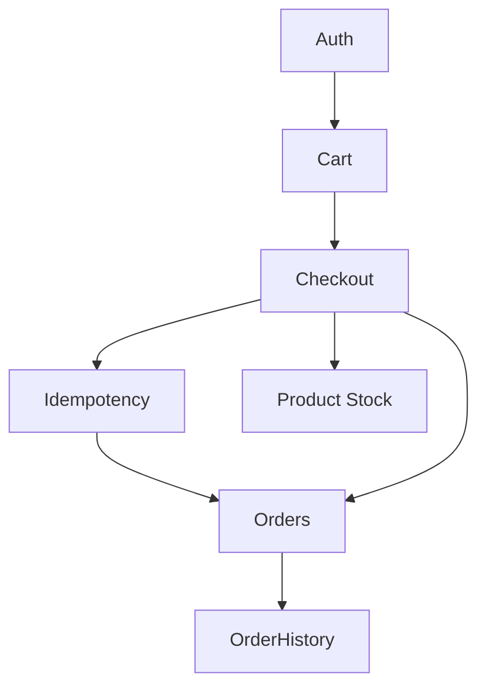

# RUDRASTRA — COMPLETE FEATURE & FUNCTIONALITY INVENTORY

## 1. Executive Summary
This document is a complete, exhaustive forensic inventory of the existing Rudrastra application surface area. It categorizes every visible, interactive, or represented feature by its actual implementation status across the repository, ensuring the product owner has full visibility before defining the MVP scope.

## 2. Complete Site Map
- **Storefront**: `/`, `/products`, `/products/[id]`, `/categories`, `/categories/[category]`, `/manufacturers`, `/manufacturers/[id]`, `/compare`, `/bom`, `/rfq`, `/sell`, `/engineering`, `/engineering/architectures`, `/engineering/calculator`, `/compatibility`, `/cart`, `/checkout`, `/checkout/success`, `/support`
- **Auth**: `/login`, `/signup`
- **Account (Buyer)**: `/account`, `/account/orders`, `/account/orders/[id]`, `/account/rma`, `/account/tickets`, `/account/warranties`
- **Seller**: `/seller/dashboard`, `/seller/catalog`, `/seller/offers`, `/seller/inventory`, `/seller/orders`, `/seller/returns`, `/seller/payouts`, `/seller/analytics`
- **Organization**: `/organization/dashboard`, `/organization/projects`, `/organization/members`, `/organization/procurement`, `/organization/procurement/approvals`, `/organization/procurement/purchase-orders`, `/organization/procurement/suppliers`, `/organization/procurement/history`
- **Ops (Admin)**: `/ops`, `/ops/control-center`, `/ops/control-center/[featureKey]`, `/ops/catalog`, `/ops/catalog/specifications`, `/ops/catalog/mpn-resolution`, `/ops/finance/ledger`, `/ops/finance/invoices`, `/ops/finance/payouts`, `/ops/finance/reports`, `/ops/fulfillment`, `/ops/incidents`, `/ops/rma`, `/ops/tickets`, `/ops/disputes`, `/ops/reconciliation`, `/ops/platform/rbac`, `/ops/platform/notifications`, `/ops/audit-logs`

## 3. User Roles
- **Anonymous Visitor**: Can browse the catalog, view products, add to cart (prompted to login), and access engineering/bom pages.
- **Registered Buyer (CUSTOMER)**: Can log in, manage cart, checkout, view order history.
- **Organization User**: Represented in UI but no real multi-tenant RBAC exists.
- **Seller**: Represented in UI but seller functionality is completely mocked.
- **Administrator (ADMIN)**: Can access `/ops` routes, manage products (Real), and toggle feature flags (Real).

## 4. Page-by-Page Inventory & Interaction Inventory

### PUBLIC / STOREFRONT
- **Homepage (`/`)**: 
  - Navigation (UI-ONLY)
  - Hero Search (UI-ONLY: redirects to `/products?q=`)
  - Featured Categories (UI-ONLY)
  - Featured Products (UI-ONLY/Mock data)
- **Product Listing (`/products`, `/categories/[category]`)**:
  - Filters & Sorting (UI-ONLY)
  - Product Cards (PARTIAL: some real products, hardcoded layout)
- **Product Details (`/products/[id]`)**:
  - Image Gallery (MOCK)
  - Overview / Title / Price (REAL)
  - Add to Cart Button (REAL)
  - Specifications Tab (MOCK)
  - Compatibility Tab (MOCK)
  - Sellers & Offers Tab (MOCK)
  - RFQ Button (MOCK)
- **Cart (`/cart`)**:
  - Add/Remove/Update Quantity (REAL)
  - Price Calculation (REAL)
  - Checkout Button (REAL)
- **Checkout (`/checkout`)**:
  - Shipping Address Form (UI-ONLY)
  - Payment Method Selection (UI-ONLY)
  - Place Order Button (REAL: atomic checkout)
- **BOM (`/bom`)**:
  - File Upload (UI-ONLY)
  - Parsing & Matching (MOCK)
- **RFQ (`/rfq`)**:
  - Form Submission (MOCK)
- **Compare (`/compare`)**:
  - Add Component (UI-ONLY)
  - Diff Table (UI-ONLY)
- **Compatibility (`/compatibility`)**:
  - Visual Graph (MOCK)

### AUTHENTICATION
- **Signup (`/signup`)**: Email/Password form (REAL)
- **Login (`/login`)**: Email/Password form (REAL)
- **Logout**: Button (REAL)
- **Session Persistence**: (REAL)
- **Role Switching**: (NOT IMPLEMENTED)

### BUYER ACCOUNT
- **Dashboard (`/account`)**: Navigation (UI-ONLY)
- **Order History (`/account/orders`)**: List of orders (REAL)
- **Order Details (`/account/orders/[id]`)**: Order items & totals (REAL)
- **Tickets/RMA/Warranties**: Pages exist (UI-ONLY)

### SELLER DASHBOARD
- **Inventory/Offers/Orders (`/seller/*`)**: All tabs and forms are (MOCK / UI-ONLY).

### ADMIN / OPS
- **Control Center (`/ops/control-center`)**: Feature flag toggles (REAL)
- **Catalog Management (`/ops/catalog`)**: Product CRUD via API (REAL)
- **Finance/Ledger/Disputes/RMA**: Pages exist (UI-ONLY)

## 5. Real vs Mock vs Partial Matrix

| Feature | UI | Implementation | API | Status |
|---|---|---|---|---|
| User Signup | `/signup` | `SupabaseAuthAdapter` | `/api/auth/signup` | **REAL** |
| User Login | `/login` | `SupabaseAuthAdapter` | `/api/auth/login` | **REAL** |
| Product Fetching | `/products/[id]` | Direct DB Query | `/api/products/[id]` | **REAL** |
| Cart CRUD | `/cart` | `SupabaseCartAdapter` | `/api/cart` | **REAL** |
| Checkout | `/checkout` | `SupabaseCheckoutAdapter` | `/api/checkout` | **REAL** |
| Order History | `/account/orders` | `SupabaseOrderAdapter` | `/api/orders` | **REAL** |
| Admin Catalog | `/ops/catalog` | Direct DB Query | `/api/admin/products` | **REAL** |
| Feature Flags | `/ops/control-center` | `CapabilityGuard` | DB | **REAL** |
| Product Search | Nav Bar | Form Submit | N/A | **UI-ONLY** |
| Specifications | PDP Tab | `MockManufacturerAdapter` | N/A | **MOCK** |
| Compatibility | PDP Tab / `/compatibility` | `MockCompatibilityAdapter` | N/A | **MOCK** |
| Multi-Seller Offers | PDP Tab / `/seller` | `MockSellerInventoryAdapter` | N/A | **MOCK** |
| RFQ | `/rfq` | `MockRfqAdapter` | N/A | **MOCK** |
| BOM | `/bom` | `MockBomAdapter` | N/A | **MOCK** |
| B2B Procurement | `/organization/*` | None | N/A | **UI-ONLY** |
| Finance & Ledger | `/ops/finance/*` | None | N/A | **UI-ONLY** |

## 6. API Inventory
| Method | Endpoint | Purpose | Auth | Status |
|---|---|---|---|---|
| GET | `/api/products` | Fetch catalog | Public | REAL |
| GET | `/api/products/[id]` | Fetch product details | Public | REAL |
| POST | `/api/auth/signup` | Create account | Public | REAL |
| POST | `/api/auth/login` | Authenticate | Public | REAL |
| POST | `/api/auth/logout` | End session | Public | REAL |
| GET | `/api/auth/session` | Get active session | Public | REAL |
| POST | `/api/admin/products` | Create product | Admin | REAL |
| PATCH | `/api/admin/products/[id]` | Update product | Admin | REAL |
| POST | `/api/cart` | Add/Update/Remove | Auth | REAL |
| POST | `/api/checkout` | Place order | Auth | REAL |
| GET | `/api/orders` | Get order history | Auth | REAL |

## 7. Database Inventory
1. `users`: Authoritative identity & roles. (Populated)
2. `sellers`: Skeleton table for seller relations. (Unused/Dormant)
3. `products`: Authoritative product catalog. (Populated)
4. `cartItems`: User carts. (Populated)
5. `orders`: Authoritative checkout state. (Populated)
6. `orderItems`: Order line items with price snapshots. (Populated)
7. `idempotencyKeys`: State machine for atomic checkouts. (Populated)
8. `featureFlags`: Control center toggles. (Populated)
9. `featureFlagAudit`: Audit trail. (Populated)

## 8. Adapter Inventory
- `SupabaseAuthAdapter.ts` (REAL)
- `MockAuthAdapter.ts` (MOCK)
- `SupabaseCartAdapter.ts` (REAL)
- `MockCartAdapter.ts` (MOCK)
- `SupabaseCheckoutAdapter.ts` (REAL)
- `MockCheckoutAdapter.ts` (MOCK)
- `SupabaseOrderAdapter.ts` (REAL)
- `MockOrderAdapter.ts` (MOCK)
- `SupabaseManufacturerAdapter.ts` (NOT IMPLEMENTED)
- `MockManufacturerAdapter.ts` (MOCK)
- `MockBomAdapter.ts` (MOCK)
- `MockCapabilitiesAdapter.ts` (MOCK)
- `MockCompatibilityAdapter.ts` (MOCK)
- `MockRfqAdapter.ts` (MOCK)
- `MockSellerInventoryAdapter.ts` (MOCK)
- `MockSellerOrdersAdapter.ts` (MOCK)

## 9. Mock Data Inventory
- Mock Manufacturer Data (in `MockManufacturerAdapter.ts`)
- Mock BOM Results (in `MockBomAdapter.ts`)
- Mock Compatibility Graph Rules (in `MockCompatibilityAdapter.ts`)
- Mock RFQ Submissions (in `MockRfqAdapter.ts`)
- Mock Seller Inventory & Offers (in `MockSellerInventoryAdapter.ts`)
- Mock Seller Orders (in `MockSellerOrdersAdapter.ts`)
- Hardcoded Taxonomy & Categories (`src/app/(storefront)/page.tsx`)

## 10. User Journey Inventory
- **Journey 1**: Visitor -> Homepage -> Click Product -> Add to Cart -> Prompt Login (REAL)
- **Journey 2**: Buyer -> Login -> Cart -> Checkout -> Order History -> Order Details (REAL)
- **Journey 3**: Buyer -> BOM Upload -> Parsed Results (MOCK)
- **Journey 4**: Buyer -> RFQ form -> Submit (MOCK)
- **Journey 5**: Seller -> Dashboard -> View Orders -> Fulfill (MOCK/UI-ONLY)
- **Journey 6**: Admin -> Ops Control Center -> Toggle Features (REAL)

## 11. Feature Dependency Graph

## 12. Feature Matrix

| Feature | MVP | Normal User | Owner Preview | Admin | Emergency Kill | Current Implementation |
|---------|-----|-------------|---------------|-------|----------------|-------------------------|
| Authentication | YES | Available | Available | Available | - | REAL |
| Product Catalog | YES | Available | Available | Available | Overrides | REAL |
| Search/Filters | YES | Available | Available | Available | Overrides | UI-ONLY |
| Cart | YES | Available | Available | Available | Overrides | REAL |
| Checkout | YES | Available | Available | Available | Overrides | REAL |
| Order History | YES | Available | Available | Available | Overrides | REAL |
| Control Center | YES | Hidden | Available | Available | - | REAL (Flags) / UI (Dashboard) |
| Admin Catalog Mgmt | YES | Hidden | Available | Available | Overrides | REAL |
| Basic Product Specs | YES | Available | Available | Available | Overrides | MOCK |
| RFQ | NO | Coming Soon | Available | Coming Soon | Overrides | MOCK |
| BOM Upload & Parsing | NO | Coming Soon | Available | Coming Soon | Overrides | MOCK |
| Compatibility Engine | NO | Coming Soon | Available | Coming Soon | Overrides | MOCK |
| Multi-Seller Offers | NO | Coming Soon | Available | Coming Soon | Overrides | MOCK |
| Seller Dashboard | NO | Coming Soon | Available | Coming Soon | Overrides | MOCK |
| B2B Procurement | NO | Coming Soon | Available | Coming Soon | Overrides | UI-ONLY |
| Finance / Ledger | NO | Coming Soon | Available | Coming Soon | Overrides | UI-ONLY |
| Warranties / RMA | NO | Coming Soon | Available | Coming Soon | Overrides | UI-ONLY |
| Tickets / Support | NO | Coming Soon | Available | Coming Soon | Overrides | UI-ONLY |
| Engineering Search | NO | Coming Soon | Available | Coming Soon | Overrides | MOCK |
| Engineering Compare | NO | Coming Soon | Available | Coming Soon | Overrides | UI-ONLY |
