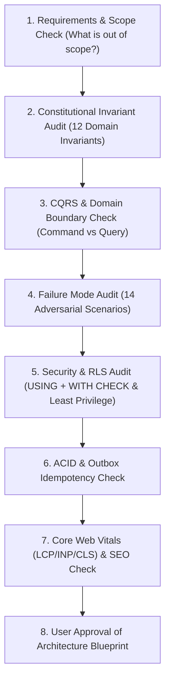

# Phase 0: Requirements & Domain Invariants
**Canonical Technical B2B Marketplace + Product Information System (PIM) + Engineering Discovery Engine**

---

## 1. Phase Objective & Engineering Scope

Phase 0 establishes the constitutional domain invariants, CQRS Command/Query rules, worker least-privilege models, and non-negotiable architectural rules that govern the Vyooma platform. Every future phase, database migration, and agent implementation MUST comply with the rules defined in this document.

### A. What We Are Building
* **The Core Asset**: A structured technical catalog (`manufacturers` + `catalog_products` + `product_variants`) and engineering compatibility graph for India's drone hardware ecosystem.
* **The Commerce Layer**: Multi-vendor commerce (`seller_offers`, `seller_skus`, `inventory`, `orders`, `b2b_procurement`, `returns`, `ledger`) is the monetization layer operating on top of authoritative engineering data.
* **Dual Identity UI**:
  * **Consumer-Facing Storefront**: Uncover-inspired visual elegance, fast static rendering, and responsive micro-animations (Vyooma's unique brand identity).
  * **Engineering-Facing Discovery Engine**: Dense technical specifications, progressive CAD LOD models, MPNs, datasheets, lead times, and compatibility trees.

---

## 2. Constitutional Domain Invariants (Hardened P0 Rules)

Every system component must satisfy these 12 domain invariants:

```text
1. IDENTITY INVARIANT:
   A product family is uniquely identified by (manufacturer_id, normalized_mpn).
   MPN is never globally unique across different manufacturers.

2. SPECIFICATION & REVISION INVARIANT:
   Technical specifications are typed, structured, normalized PIM data (McMaster-Carr model).
   Current canonical state is authoritative in catalog_products / product_variants / product_spec_values.
   Historical revisions (product_revisions / revision_spec_values) are immutable historical snapshots.

3. INVENTORY ACCOUNTING INVARIANT:
   Sellable Stock = On-Hand Stock - Reserved Stock.
   Always enforce reserved_quantity <= on_hand_quantity. Never use the ambiguous term "available".

4. TENANCY & SELLER IDENTITY INVARIANT:
   Sellers operate within B2B Organizations (seller_accounts -> organization_id).
   A seller can only view and mutate their own offers, inventory locations, seller orders, and shipments.

5. CONCURRENCY INVARIANT:
   All stock reservations execute using explicit PostgreSQL row locking (SELECT ... FOR UPDATE SKIP LOCKED)
   combined with location-aware allocation algorithms and 10-minute TTL reservation records.

6. FINANCIAL LEDGER INVARIANT:
   The financial ledger operates as a double-entry-capable immutable accounting ledger (ledger_accounts,
   ledger_transactions, ledger_entries). Never update or delete ledger entries; corrections require compensating entries.

7. HISTORICAL RECONSTRUCTION INVARIANT:
   Order items and order addresses store immutable snapshots at checkout time. Orders remain reconstructable
   even if catalog, seller, or address rows are modified or deleted later.

8. MULTI-SELLER & MULTI-PACKAGE FULFILLMENT INVARIANT:
   A customer order (orders) splits into seller-specific fulfillment units (seller_orders), which can further
   split into N multi-warehouse Shiprocket packages (shipments -> shipment_items).

9. PROCUREMENT LINE-ITEM & APPROVAL INVARIANT:
   All RFQs, Quotes, and POs must model explicit line items (purchase_request_items, quote_items,
   purchase_order_items) and audit-ready approval executions (approval_requests, approval_steps, approval_actions).

10. REBUILDABLE SEARCH INVARIANT:
    Typesense is a derived, disposable read index. If Typesense dies, it is 100% reconstructible from PostgreSQL.

11. OUTBOX AT-LEAST-ONCE & IDEMPOTENCY INVARIANT:
    Outbox delivery is at-least-once. Outbox handlers must be idempotent even if an event is processed
    successfully and the worker crashes before marking it processed.

12. CQRS & LEAST-PRIVILEGE WORKER INVARIANT:
    Commands own mutations; Queries never mutate. No arbitrary status CRUD updates are allowed.
    Background workers must declare explicit capabilities from WORKER_CAPABILITIES.
```

---

## 3. Mandatory Engineering Control Flow (Architecture Review Protocol)

Before implementing any feature or schema modification, agents must execute the following evaluation sequence:



---

## 4. Acceptance Criteria / Definition of Done

* [x] All 12 constitutional invariants are explicitly documented and referenced across `.agents/AGENTS.md` and `ARCHITECTURE.md`.
* [x] The distinction between Canonical Catalog (`catalog_products`, `product_variants`) and Seller Offers (`seller_offers`, `seller_skus`) is enforced in all phase specifications.
* [x] All 16 sequential phases (Phase 0 to Phase 15) are defined with explicit cross-phase dependencies.
