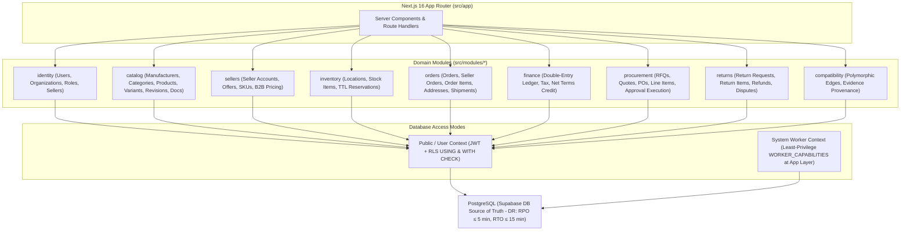

# Phase 1: Architecture, CQRS Contracts & 19 Adversarial Failure Modes
**Canonical Technical B2B Marketplace + Product Information System (PIM) + Engineering Discovery Engine**
**Architecture v1.0 — Structurally Hardened, Pending Final Consistency Audit**

---

## 1. Phase Objective

Phase 1 defines the **Modular Monolith** domain architecture, Command vs. Query Responsibility Segregation (CQRS) contracts, transactional outbox infrastructure, and **19 Mandatory Adversarial Failure-Mode Mitigations**. This ensures the platform scales cleanly without microservice sprawl while preventing silent data corruption under concurrency, network replay, and disaster scenarios.

---

## 2. Modular Monolith Architecture & CQRS Contracts (`src/modules/<domain>/`)

### Strict CQRS & Module Boundary Rules (Mechanically Enforced via CI)
* **Directory Contract**: Each domain module in `src/modules/<domain>/` is partitioned into `commands/`, `queries/`, `domain/`, and `repositories/`.
* **Commands Own Mutations**: Any mutation (`createOrder()`, `reserveInventory()`, `approvePO()`, `capturePayment()`) must execute as an explicit Command method within an ACID database transaction.
* **Queries Never Mutate**: Read operations inside `queries/` **cannot import mutation repositories** or execute `insert()`, `update()`, or `delete()`.
* **No Arbitrary Status CRUD**: Status columns cannot be updated via generic `update({ status: newStatus })` calls. They must pass through state-machine Command transitions in `domain/`.

---

## 3. Mandatory 19 Adversarial Failure-Mode Matrix

| # | Failure Mode / Edge Case | Architectural Mitigation | Required Verification |
| :---: | :--- | :--- | :--- |
| **1** | **Two buyers purchase last stock item simultaneously** | Transactional row locking (`SKIP LOCKED`), TTL reservations, and location-aware allocation. | Playwright concurrency E2E test (`E2E-01`). |
| **2** | **Payment webhook arrives twice (Replay attack / network retry)** | Idempotency key verification against `processed_webhooks` table within an ACID transaction. | Webhook replay unit test. |
| **3** | **Typesense index crashes or becomes out of sync** | Typesense is disposable. Admin endpoint `/api/admin/search/rebuild` reconstructs 100% of index in < 60s. | Index DR rebuild test (`E2E-05`). |
| **4** | **Seller uploads malicious PDF/CAD/ZIP file** | Files uploaded to isolated R2 bucket; metadata stores `checksum_sha256`, `mime_type`, and `malware_scan_status`. | File verification test rejecting unscanned files. |
| **5** | **Seller modifies product price/specs after buyer order** | `order_items` stores complete immutable checkout snapshots (`variant_id`, `revision_no`, `mpn`, `unit_price_inr`). | Order snapshot test. |
| **6** | **SKIP LOCKED returns zero rows when stock exists in another location** | Multi-location allocation checks secondary location sellable stock (`on_hand_quantity - reserved_quantity`). | Multi-location allocation test. |
| **7** | **Outbox worker crashes mid-event processing** | Outbox guarantees at-least-once delivery; consumers must be idempotent even under crash-recovery replay. | Outbox crash-replay unit test. |
| **8** | **Duplicate order submission (user double-clicks checkout button)** | Client idempotency key + database unique constraint on checkout token guarantees exactly ONE order is created. | Playwright double-click checkout test. |
| **9** | **Out-of-order webhook (`PAYMENT_CAPTURED` arrives after `REFUND`)** | Payment state machine rejects invalid state transitions; out-of-order webhooks trigger DLQ reconciliation flag. | State machine transition unit test. |
| **10** | **Price changes during active checkout (`₹8,000 -> ₹9,000`)** | Active `inventory_reservations` lock both quantity and quoted unit price for the 10-minute TTL window. | Active checkout price-lock test. |
| **11** | **Seller account suspended or deleted after purchase** | Historical order snapshots (`seller_name_snapshot`, `seller_sku_snapshot`) and address snapshots remain operational. | Seller suspension regression test. |
| **12** | **Product family merged after purchase** | Order items reference immutable checkout snapshots; `catalog_merge_logs` tracks target redirect without altering order rows. | Product merge audit test. |
| **13** | **Inventory reservation expires during Razorpay payment processing** | Payment capture webhook checks reservation TTL; if expired and stock sold out, triggers automated refund and notification. | Expired reservation refund test. |
| **14** | **Partial seller fulfillment (3 of 5 items fulfilled)** | `seller_order` supports multi-package `shipments` -> `shipment_items` with line-item level fulfillment tracking. | Multi-package partial fulfillment test. |
| **15** | **Duplicate payment capture (two identical capture requests)** | Database transaction checks `financial_transactions` for existing `razorpay_payment_id` before capture execution. | Duplicate payment capture unit test. |
| **16** | **Partial refund balance (`₹10k order -> ₹4k refund -> ₹6k remains`)** | Double-entry ledger posts exact debit/credit entries for ₹4,000; checks remaining order balance invariance. | Partial refund ledger balance test. |
| **17** | **Seller payout failure after successful customer payment** | Customer order remains `'PAID'`; payout failure logs to `payout_exceptions` for retry without invalidating order. | Marketplace payout failure resilience test. |
| **18** | **RTO (Return to Origin - `SHIPPED -> RTO -> RETURNED`)** | Logistics webhook state machine transitions shipment to `RTO`, releasing reserved stock back to location sellable stock. | RTO logistics lifecycle test. |
| **19** | **Database PITR Restore + Outbox Replay** | After database restore, outbox replay workers verify external API idempotency keys to prevent duplicate emails/shipments. | DR restore + outbox idempotency test. |

---

## 4. Acceptance Criteria / Definition of Done

* [x] CQRS Command vs. Query directory separation (`commands/`, `queries/`, `domain/`, `repositories/`) is documented.
* [x] All 19 adversarial failure modes have explicit architectural mitigations and automated verification plans.
* [x] Disaster Recovery SLOs (`RPO ≤ 5 min`, `RTO ≤ 15 min` for DB; `RTO ≤ 60s` for Search) are defined.
