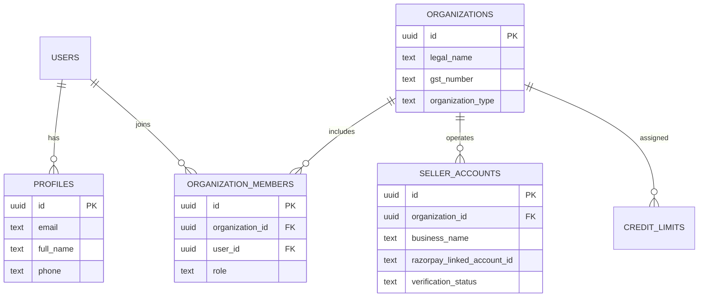
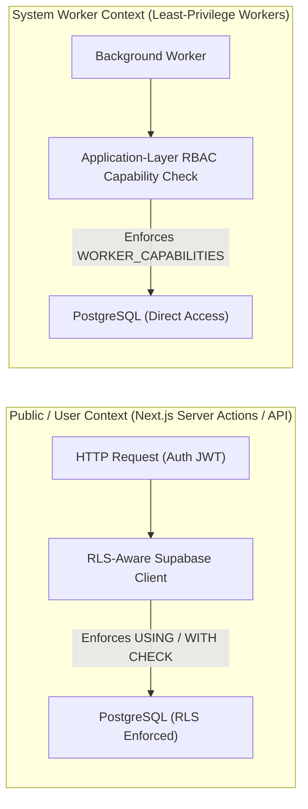

# Phase 2: Identity, Tenancy & Authorization Model
**Canonical Technical B2B Marketplace + Product Information System (PIM) + Engineering Discovery Engine**

---

## 1. Phase Objective

Phase 2 establishes the multi-tenant identity and authorization foundation before any catalog or commerce tables are created. It solves P0 Issues #6, #7, #8, and #9 by modeling:
1. **B2B Organizations as Tenancy Roots**: A seller is a business (`seller_accounts`), not an arbitrary user ID.
2. **Two Database Access Modes**: Distinguishing public/user RLS context from privileged system worker execution.
3. **Least-Privilege Worker Capability Model**: Preventing service-role workers from having unrestricted database authority.
4. **Strict RLS Policy Execution**: Mandating both visibility (`USING`) and mutation validity (`WITH CHECK`).

---

## 2. Identity & Tenancy ERD



---

## 3. Two Database Access Modes & Least-Privilege Worker Capabilities



### Least-Privilege Worker Capability Model (`WORKER_CAPABILITIES`)
To prevent a single compromised background job from having full database authority, every worker must explicitly declare one or more capabilities:

```typescript
export type WorkerCapability =
  | 'SEARCH_INDEX_WRITE'
  | 'OUTBOX_PROCESS'
  | 'SHIPMENT_SYNC'
  | 'EMAIL_SEND'
  | 'CATALOG_REBUILD'
  | 'LEDGER_RECONCILIATION';

export function authorizeWorker(requiredCapabilities: WorkerCapability[], workerContext: { capabilities: WorkerCapability[] }) {
  for (const cap of requiredCapabilities) {
    if (!workerContext.capabilities.includes(cap)) {
      throw new Error(`Worker security exception: Missing required capability [${cap}]`);
    }
  }
}
```

---

## 4. Drizzle Schema (`src/modules/identity/schema.ts`)

```typescript
import { pgTable, uuid, text, timestamp, unique } from 'drizzle-orm/pg-core';

// 1. User Profiles (Extending Supabase auth.users)
export const profiles = pgTable('profiles', {
  id: uuid('id').primaryKey(),
  email: text('email').notNull().unique(),
  fullName: text('full_name').notNull(),
  phone: text('phone'),
  createdAt: timestamp('created_at', { withTimezone: true }).defaultNow().notNull(),
});

// 2. B2B Organizations (Tenancy Root)
export const organizations = pgTable('organizations', {
  id: uuid('id').defaultRandom().primaryKey(),
  legalName: text('legal_name').notNull(),
  displayName: text('display_name').notNull(),
  gstNumber: text('gst_number').unique(),
  organizationType: text('organization_type').notNull(), // 'OEM' | 'SELLER' | 'ENTERPRISE_BUYER'
  createdAt: timestamp('created_at', { withTimezone: true }).defaultNow().notNull(),
});

// 3. Organization Members & Role Hierarchies
export const organizationMembers = pgTable('organization_members', {
  id: uuid('id').defaultRandom().primaryKey(),
  organizationId: uuid('organization_id').notNull().references(() => organizations.id),
  userId: uuid('user_id').notNull().references(() => profiles.id),
  role: text('role').notNull(), // 'OWNER' | 'BUYER' | 'APPROVER' | 'FINANCE' | 'SELLER_ADMIN'
  createdAt: timestamp('created_at', { withTimezone: true }).defaultNow().notNull(),
}, (table) => ({
  uniqueOrgMember: unique().on(table.organizationId, table.userId),
}));

// 4. Seller Accounts (B2B Businesses, not individual users)
export const sellerAccounts = pgTable('seller_accounts', {
  id: uuid('id').defaultRandom().primaryKey(),
  organizationId: uuid('organization_id').notNull().references(() => organizations.id),
  businessName: text('business_name').notNull(),
  razorpayLinkedAccountId: text('razorpay_linked_account_id'),
  verificationStatus: text('verification_status').default('PENDING').notNull(),
  createdAt: timestamp('created_at', { withTimezone: true }).defaultNow().notNull(),
});
```

---

## 5. Mandatory RLS Policy Specifications (`USING` + `WITH CHECK`)

```sql
ALTER TABLE organizations ENABLE ROW LEVEL SECURITY;
ALTER TABLE organization_members ENABLE ROW LEVEL SECURITY;
ALTER TABLE seller_accounts ENABLE ROW LEVEL SECURITY;

CREATE POLICY "Members view own organization" ON organizations
  FOR SELECT TO authenticated
  USING (
    id IN (SELECT organization_id FROM organization_members WHERE user_id = auth.uid())
  );

CREATE POLICY "Owners update own organization" ON organizations
  FOR UPDATE TO authenticated
  USING (
    id IN (SELECT organization_id FROM organization_members WHERE user_id = auth.uid() AND role = 'OWNER')
  )
  WITH CHECK (
    id IN (SELECT organization_id FROM organization_members WHERE user_id = auth.uid() AND role = 'OWNER')
  );

CREATE POLICY "Members view own seller account" ON seller_accounts
  FOR SELECT TO authenticated
  USING (
    organization_id IN (SELECT organization_id FROM organization_members WHERE user_id = auth.uid())
  );

CREATE POLICY "Seller Admins update own seller account" ON seller_accounts
  FOR UPDATE TO authenticated
  USING (
    organization_id IN (
      SELECT organization_id FROM organization_members 
      WHERE user_id = auth.uid() AND role IN ('OWNER', 'SELLER_ADMIN')
    )
  )
  WITH CHECK (
    organization_id IN (
      SELECT organization_id FROM organization_members 
      WHERE user_id = auth.uid() AND role IN ('OWNER', 'SELLER_ADMIN')
    )
  );
```

---

## 6. Acceptance Criteria / Definition of Done

* [x] Schema models `seller_accounts` as a business belonging to an `organization_id`.
* [x] Every RLS mutation policy explicitly defines both `USING` and `WITH CHECK`.
* [x] Least-Privilege Worker Capability Model (`WORKER_CAPABILITIES`) is explicitly defined.
