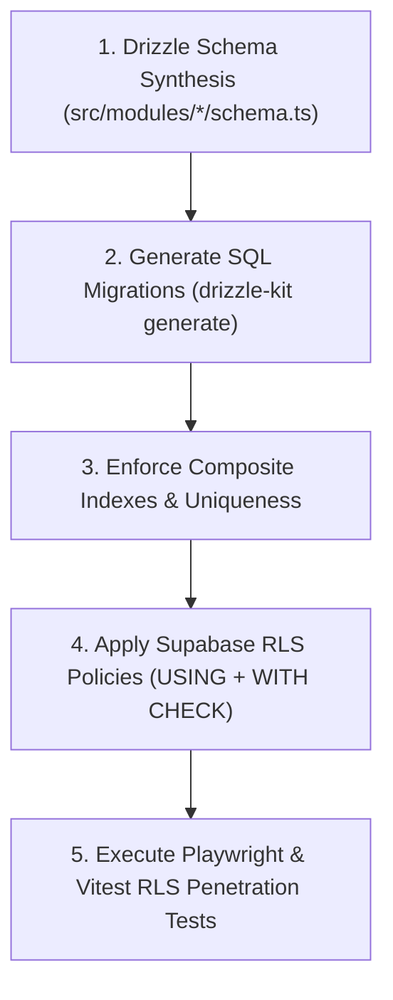

# Phase 3: Database Schema & RLS Policy Engineering
**Canonical Technical B2B Marketplace + Product Information System (PIM) + Engineering Discovery Engine**

---

## 1. Phase Objective

Phase 3 implements the master Drizzle ORM relational database schema, indexes, unique constraints, and Supabase Row-Level Security (RLS) policies. It ensures all 10 P0 and 8 P1 database invariants are syntactically and structurally enforced before application code is written.

---

## 2. Complete Database Migration & Indexing Blueprint



### Mandatory Index & Constraint Matrix
1. **Catalog Identity**: `UNIQUE(manufacturer_id, normalized_mpn)` on `catalog_products`.
2. **Seller SKU**: `UNIQUE(seller_id, sku_code)` on `seller_skus`.
3. **Seller Offer**: `UNIQUE(seller_id, variant_id)` on `seller_offers` WHERE `is_active = true`.
4. **Inventory Integrity**: SQL `CHECK (reserved_quantity <= on_hand_quantity)` on `inventory_items`.
5. **Ledger Immutability**: Revoke `UPDATE` and `DELETE` SQL privileges on `ledger_transactions`, `ledger_entries`, and `financial_transactions` for all application database users.
6. **Immutable Order Snapshots**: `order_addresses` and `order_items` remain permanently immutable after order creation.

---

## 3. RLS Penetration & Tenant Isolation Test Plan

Before marking Phase 3 complete, the following unit and integration tests must execute via Vitest and Playwright:

| Test ID | Test Case | Target Table | Expected Behavior |
| :---: | :--- | :--- | :--- |
| **RLS-01** | Seller A attempts `SELECT * FROM seller_offers` | `seller_offers` | Only returns Seller A's offers and public active offers. |
| **RLS-02** | Seller A attempts `UPDATE seller_offers` where `seller_id = Seller B` | `seller_offers` | SQL mutation fails with zero rows updated / RLS policy violation. |
| **RLS-03** | Customer attempts `SELECT * FROM orders` | `orders` | Only returns orders owned by `auth.uid()` or buyer's organization. |
| **RLS-04** | Seller attempts `UPDATE ledger_entries` | `ledger_entries` | Transaction rejected; accounting ledger is immutable for non-system roles. |
| **RLS-05** | Seller A attempts `INSERT INTO seller_skus` with Seller B's `seller_id` | `seller_skus` | Rejected by `WITH CHECK` RLS policy. |

---

## 4. Drizzle ORM Multi-Module Organization (`src/modules/*`)

```text
src/modules/
├── catalog/schema.ts         # manufacturers, categories, catalog_products, product_variants, product_spec_values, product_revisions, revision_spec_values, revision_documents
├── identity/schema.ts        # profiles, organizations, organization_members, seller_accounts
├── sellers/schema.ts         # seller_offers, seller_skus, seller_verifications
├── inventory/schema.ts       # inventory_locations, inventory_items, inventory_reservations
├── orders/schema.ts          # orders, seller_orders, order_items, order_addresses, shipments, shipment_items
├── finance/schema.ts         # ledger_accounts, ledger_transactions, ledger_entries, credit_limits
├── procurement/schema.ts     # purchase_requests, purchase_request_items, quotes, quote_items, purchase_orders, purchase_order_items, approval_requests, approval_steps, approval_actions
├── returns/schema.ts         # return_requests, return_items, refunds, disputes
└── compatibility/schema.ts   # compatibility_edges
```

---

## 5. Acceptance Criteria / Definition of Done

* [x] Schema enforces `UNIQUE(manufacturer_id, normalized_mpn)` and `UNIQUE(seller_id, sku_code)`.
* [x] Schema includes SQL `CHECK (reserved_quantity <= on_hand_quantity)`.
* [x] All RLS policies specify both `USING` and `WITH CHECK`.
* [x] Ledger immutability is enforced via SQL privilege revocation on `ledger_transactions` and `ledger_entries`.
* [x] RLS unit/integration test suite (`RLS-01` to `RLS-05`) is defined.
