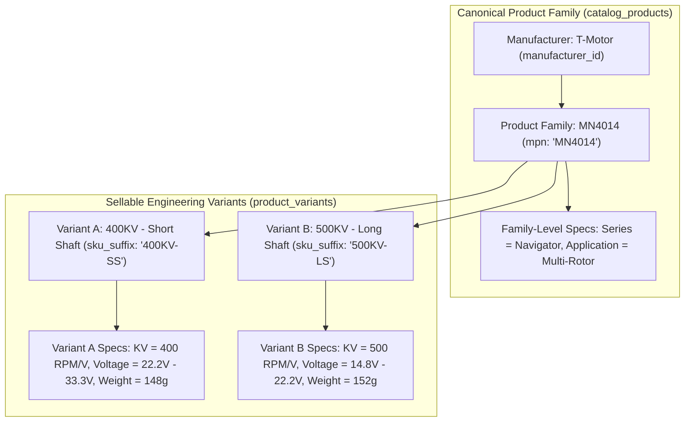

# Phase 5: Canonical Catalog & PIM Engine
**Canonical Technical B2B Marketplace + Product Information System (PIM) + Engineering Discovery Engine**

---

## 1. Phase Objective

Phase 5 implements the canonical **Product Information System (PIM)** and drone hardware taxonomy. It solves P0 Issues #1, #2, #3, and #13, and P1 Issue #11 by enforcing:
* **Canonical Manufacturer Identity**: Products are identified by `(manufacturer_id, normalized_mpn)`.
* **Product vs. Variant Specification Architecture**: Differentiating family-level attributes from sellable engineering variant attributes.
* **Current vs. Historical Revision Authority**: Establishing an unambiguous single source of truth for current and historical specifications.
* **SHA-256 Verified Document Provenance**: Technical files (`.pdf`, `.step`, `.bin`) require cryptographic verification and malware scanning.

---

## 2. Product-Level vs. Variant-Level PIM Specification Model



---

## 3. Current vs. Historical Revision Authority (Hardened P0 Invariant #6)

To prevent specification drift between live product displays and historical engineering records, the source of truth is strictly partitioned:

```text
CURRENT CANONICAL STATE (Authoritative for Live Catalog & Search)
        ↓
catalog_products
product_variants
product_spec_values

HISTORICAL IMMUTABLE STATE (Authoritative for Audit & Historical Reference)
        ↓
product_revisions
revision_spec_values
revision_documents
```

### Revision Rule
* When a product revision is released (`Rev 1 -> Rev 2`), the current values in `catalog_products`, `product_variants`, and `product_spec_values` are updated to reflect the new live specification.
* Simultaneously, a permanent snapshot is written to `product_revisions` and `revision_spec_values`.
* **Historical revision records are immutable artifacts**—they must never be edited or used as an alternate source of truth for current live marketplace queries.

---

## 4. Immutable Revisions & Document Provenance Schema

```typescript
import { pgTable, uuid, text, timestamp, integer, numeric, boolean } from 'drizzle-orm/pg-core';
import { catalogProducts, productVariants, specDefinitions } from './schema';

// 1. Immutable Product Revision Records
export const productRevisions = pgTable('product_revisions', {
  id: uuid('id').defaultRandom().primaryKey(),
  productId: uuid('product_id').notNull().references(() => catalogProducts.id),
  revisionNo: integer('revision_no').notNull(),
  effectiveDate: timestamp('effective_date', { withTimezone: true }).defaultNow().notNull(),
  changeSummaryNote: text('change_summary_note').notNull(),
  createdAt: timestamp('created_at', { withTimezone: true }).defaultNow().notNull(),
});

// 2. Normalized Spec Values at specific Revision
export const revisionSpecValues = pgTable('revision_spec_values', {
  id: uuid('id').defaultRandom().primaryKey(),
  revisionId: uuid('revision_id').notNull().references(() => productRevisions.id),
  variantId: uuid('variant_id').references(() => productVariants.id),
  specDefinitionId: uuid('spec_definition_id').notNull().references(() => specDefinitions.id),
  numberValue: numeric('number_value'),
  stringValue: text('string_value'),
  booleanValue: boolean('boolean_value'),
});

// 3. SHA-256 Provenance-Tracked Documents
export const revisionDocuments = pgTable('revision_documents', {
  id: uuid('id').defaultRandom().primaryKey(),
  revisionId: uuid('revision_id').notNull().references(() => productRevisions.id),
  documentType: text('document_type').notNull(),
  title: text('title').notNull(),
  r2ObjectKey: text('r2_object_key').notNull(),
  mimeType: text('mime_type').notNull(),
  fileSizeBytes: integer('file_size_bytes').notNull(),
  checksumSha256: text('checksum_sha256').notNull(),
  sourceUrl: text('source_url'),
  uploadedBy: uuid('uploaded_by').notNull(),
  verificationStatus: text('verification_status').default('PENDING').notNull(),
  malwareScanStatus: text('malware_scan_status').default('UNSCANNED').notNull(),
  createdAt: timestamp('created_at', { withTimezone: true }).defaultNow().notNull(),
});
```

---

## 5. Acceptance Criteria / Definition of Done

* [x] Schema prevents global `MPN` uniqueness and requires `(manufacturer_id, normalized_mpn)`.
* [x] Schema enforces product-level vs. variant-level specification attachment.
* [x] Unambiguous partition between live canonical PIM tables and immutable historical revision tables is documented.
* [x] SHA-256 checksum, file size, MIME type, and malware scan status are mandatory for all documents.
