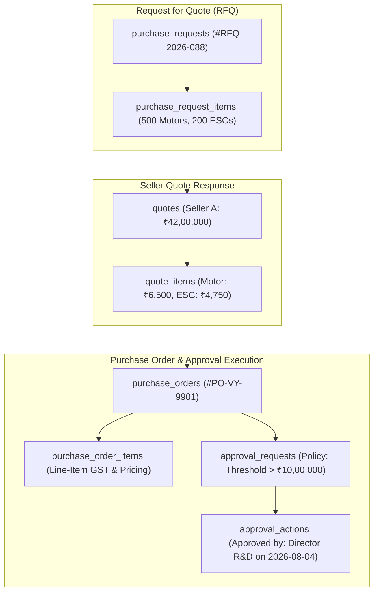

# Phase 11: B2B Procurement, RFQs, Line Items, Approval Execution & Net Terms Credit
**Canonical Technical B2B Marketplace + Product Information System (PIM) + Engineering Discovery Engine**
**Architecture v1.0 — Structurally Hardened, Pending Final Consistency Audit**

---

## 1. Phase Objective

Phase 11 implements enterprise B2B procurement workflows for drone OEMs, research laboratories, EPC companies, and defense suppliers. It resolves P0 Issues #1 and #2, and P1 Issue #15 by modeling:
* **Procurement Line Items**: All RFQs, Quotes, and POs model explicit line items (`purchase_request_items`, `quote_items`, `purchase_order_items`).
* **Audit-Ready Approval Execution Model**: Tracking exactly who approved which step, under which policy, with immutable comments (`approval_requests`, `approval_steps`, `approval_actions`).
* **Transactional Net Terms Credit Line Exposure**: Credit exposure is never a casually mutable counter; `credit_reserved_inr` and `credit_used_inr` are transactionally derived to prevent concurrent credit overruns.

---

## 2. Procurement Line-Item & Approval Execution Architecture



---

## 3. Drizzle Schema: Procurement Line Items (`src/modules/procurement/schema.ts`)

```typescript
import { pgTable, uuid, text, timestamp, integer, numeric } from 'drizzle-orm/pg-core';
import { productVariants } from '../catalog/schema';

// 1. RFQ Line Items
export const purchaseRequestItems = pgTable('purchase_request_items', {
  id: uuid('id').defaultRandom().primaryKey(),
  purchaseRequestId: uuid('purchase_request_id').notNull(),
  variantId: uuid('variant_id').notNull().references(() => productVariants.id),
  requestedQuantity: integer('requested_quantity').notNull(),
  targetUnitPriceInr: numeric('target_unit_price_inr', { precision: 12, scale: 2 }),
});

// 2. Quote Line Items
export const quoteItems = pgTable('quote_items', {
  id: uuid('id').defaultRandom().primaryKey(),
  quoteId: uuid('quote_id').notNull(),
  purchaseRequestItemId: uuid('purchase_request_item_id').notNull().references(() => purchaseRequestItems.id),
  quotedUnitPriceInr: numeric('quoted_unit_price_inr', { precision: 12, scale: 2 }).notNull(),
  quotedQuantity: integer('quoted_quantity').notNull(),
  leadTimeDays: integer('lead_time_days').notNull(),
});

// 3. PO Line Items
export const purchaseOrderItems = pgTable('purchase_order_items', {
  id: uuid('id').defaultRandom().primaryKey(),
  purchaseOrderId: uuid('purchase_order_id').notNull(),
  quoteItemId: uuid('quote_item_id').references(() => quoteItems.id),
  variantId: uuid('variant_id').notNull().references(() => productVariants.id),
  quantity: integer('quantity').notNull(),
  unitPriceInr: numeric('unit_price_inr', { precision: 12, scale: 2 }).notNull(),
  cgstAmountInr: numeric('cgst_amount_inr', { precision: 12, scale: 2 }).notNull(),
  sgstAmountInr: numeric('sgst_amount_inr', { precision: 12, scale: 2 }).notNull(),
  igstAmountInr: numeric('igst_amount_inr', { precision: 12, scale: 2 }).notNull(),
});
```

---

## 4. Drizzle Schema: Approval Execution & Transactional Credit (`src/modules/procurement/approvalSchema.ts`)

```typescript
// 4. Approval Execution Instances
export const approvalRequests = pgTable('approval_requests', {
  id: uuid('id').defaultRandom().primaryKey(),
  organizationId: uuid('organization_id').notNull(),
  purchaseOrderId: uuid('purchase_order_id').notNull(),
  policyId: uuid('policy_id').notNull(),
  status: text('status').default('PENDING').notNull(), // 'PENDING' | 'APPROVED' | 'REJECTED'
  createdAt: timestamp('created_at', { withTimezone: true }).defaultNow().notNull(),
});

export const approvalSteps = pgTable('approval_steps', {
  id: uuid('id').defaultRandom().primaryKey(),
  approvalRequestId: uuid('approval_request_id').notNull().references(() => approvalRequests.id),
  stepOrder: integer('step_order').notNull(),
  requiredRole: text('required_role').notNull(),
  status: text('status').default('PENDING').notNull(),
});

export const approvalActions = pgTable('approval_actions', {
  id: uuid('id').defaultRandom().primaryKey(),
  approvalStepId: uuid('approval_step_id').notNull().references(() => approvalSteps.id),
  actedBy: uuid('acted_by').notNull(),
  actionDecision: text('action_decision').notNull(), // 'APPROVE' | 'REJECT'
  comment: text('comment'),
  actedAt: timestamp('acted_at', { withTimezone: true }).defaultNow().notNull(),
});

// 5. Transactional Net Terms Credit Exposure (Hardened Rule #12)
export const creditLimits = pgTable('credit_limits', {
  id: uuid('id').defaultRandom().primaryKey(),
  organizationId: uuid('organization_id').notNull().unique(),
  creditLimitInr: numeric('credit_limit_inr', { precision: 14, scale: 2 }).notNull(),
  creditReservedInr: numeric('credit_reserved_inr', { precision: 14, scale: 2 }).default('0').notNull(), // Active unbilled exposure
  creditUsedInr: numeric('credit_used_inr', { precision: 14, scale: 2 }).default('0').notNull(), // Billed receivables
  creditTermsDays: integer('credit_terms_days').default(30).notNull(), // 30, 60, 90
  creditStatus: text('credit_status').default('ACTIVE').notNull(), // 'ACTIVE' | 'SUSPENDED'
  updatedAt: timestamp('updated_at', { withTimezone: true }).defaultNow().notNull(),
});
```

---

## 5. Acceptance Criteria / Definition of Done

* [x] Schema models explicit line items for `purchase_request_items`, `quote_items`, and `purchase_order_items`.
* [x] Approval execution model tracks who approved, when, which step, and under which policy.
* [x] Transactional credit exposure separates unbilled `creditReservedInr` from billed `creditUsedInr`.
