# Phase 15: Production Readiness, E2E Concurrency & Go-Live Sign-Off
**Canonical Technical B2B Marketplace + Product Information System (PIM) + Engineering Discovery Engine**
**Architecture v1.0 — Structurally Hardened, Pending Final Consistency Audit**

---

## 1. Phase Objective

Phase 15 is the final production readiness checkpoint. It verifies that all 8 Commandments, 12 Constitutional Invariants, and **19 Mandatory Adversarial Failure Modes** pass automated regression testing, concurrency stress testing, disaster recovery verification, and observability sign-off before public traffic is routed to Vyooma.

---

## 2. Playwright & Vitest 19-Scenario Adversarial Test Suite

```mermaid
graph TD
    subgraph E2E ["Mandatory 19-Scenario Adversarial Regression Suite"]
        T1["1. Inventory Concurrency Race Condition (SKIP LOCKED)"]
        T2["2. Webhook Idempotency Replay (Razorpay Route Split)"]
        T3["3. Typesense Index DR Rebuild (/api/admin/search/rebuild in < 60s)"]
        T4["4. Malicious Upload Rejection (SHA-256 + Malware Scan)"]
        T5["5. Complete Immutable Order Item & Tax Snapshots"]
        T6["6. Multi-Location Allocation Secondary Fallback"]
        T7["7. Outbox Worker Crash Replay Idempotency"]
        T8["8. Duplicate Order Submission (Double-Click Checkout)"]
        T9["9. Out-of-Order Webhook Rejection (CAPTURE after REFUND)"]
        T10["10. Active Checkout Price-Lock Invariance (10-minute TTL)"]
        T11["11. Seller Account Suspension / Deletion Order Resilience"]
        T12["12. Product Family Merger Historical Order Integrity"]
        T13["13. Inventory Reservation Expiration mid-Payment Processing"]
        T14["14. Multi-Package Partial Seller Fulfillment (3/5 items)"]
        T15["15. Duplicate Payment Capture Resilience"]
        T16["16. Partial Refund Ledger Balance Invariance (₹10k - ₹4k = ₹6k)"]
        T17["17. Seller Payout Failure after Customer Capture"]
        T18["18. Logistics RTO Lifecycle (SHIPPED -> RTO -> RETURNED)"]
        T19["19. Database PITR Restore + Outbox Replay Idempotency"]
    end

    T1 & T2 & T3 & T4 & T5 & T6 & T7 & T8 & T9 & T10 & T11 & T12 & T13 & T14 & T15 & T16 & T17 & T18 & T19 --> PASS{"All 19 Scenarios Pass?"}
    PASS -->|Yes| PROD["Production Sign-Off Approved"]
    PASS -->|No| FAIL["Block Deployment & Alert Engineering"]
```

---

## 3. Comprehensive Production Readiness & DR SLO Checksheet

| Domain Area | Mandatory Requirement | SLO / Metric Target | Sign-Off Owner |
| :--- | :--- | :---: | :---: |
| **Catalog & Identity** | `(manufacturer_id, normalized_mpn)` uniqueness enforced. | 0 Duplicate MPNs | Catalog Eng |
| **Inventory Concurrency** | `SKIP LOCKED` location allocation + TTL tested under load. | 0 Over-reservations | Backend Eng |
| **Financial Ledger** | Double-Entry ledger + SQL privilege revocation verified. | 0 Imbalances (`SUM=0`) | Finance Eng |
| **Security & RLS** | All tenant mutation policies use `USING` + `WITH CHECK`. | 100% RLS Coverage | Security Lead |
| **Worker Capabilities** | Least-privilege `WORKER_CAPABILITIES` RBAC verified. | 0 Unscoped Workers | Security Lead |
| **Search DR** | `rebuildTypesenseIndex()` reconstructs index from Postgres. | **RTO ≤ 60 seconds** | Infrastructure |
| **PostgreSQL DR** | Complete point-in-time recovery (PITR) backup & restore. | **RPO ≤ 5 min, RTO ≤ 15 min** | DBA / DevOps |
| **Procurement & Net Terms** | RFQ line items, approval execution, and credit exposure. | 100% Audit Trail | Enterprise Eng |

---

## 4. Observability & Audit Trail Architecture

* **Sentry Integration**: Captures unhandled Server Action errors, outbox worker failures, and Razorpay signature verification failures with full transaction context.
* **PostHog Integration**: Tracks engineering discovery funnels (`Datasheet Downloaded -> CAD Viewed -> BOM Created -> Checkout Completed`) without logging PII.
* **Immutable Audit Logging**: Every critical mutation (`SELLER_VERIFIED`, `PO_APPROVED`, `LEDGER_ENTRY_CREATED`, `CATALOG_MERGED`) logs an immutable entry to `audit_logs` (`id`, `actor_id`, `action_type`, `entity_type`, `entity_id`, `before_state`, `after_state`, `ip_address`).

---

## 5. Acceptance Criteria / Definition of Done

* [x] All 19 mandatory adversarial test workflows are written and passing in CI/CD.
* [x] Sentry error alerting and PostHog engineering analytics funnels are configured.
* [x] Disaster Recovery SLOs (`RPO ≤ 5 min`, `RTO ≤ 15 min` for DB; `RTO ≤ 60s` for Search) are verified and signed off.
