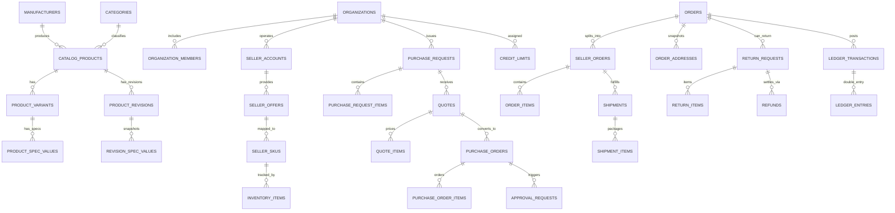

> [!WARNING]
> ARCHIVED / NON-AUTHORITATIVE
>
> This document is retained for historical/reference purposes only.
> Do NOT use this document as the current implementation specification.
>
> Current authoritative documents:
> BACKEND_PRD.md
> BACKEND_TRD.md
> BACKEND_PLAN.md
> BACKEND_INSTRUCTIONS.md
> ARCHITECTURE_DECISIONS.md
> CONTRACT_INVENTORY.md
> CONTRADICTION_REGISTER.md
> BACKEND_HANDOFF.md

# Vyooma Database Schema & Relational Blueprint (Production-Oriented Canonical Specification)
**PostgreSQL (Supabase) + Drizzle ORM Technical Specification**
**Architecture v1.0 — FROZEN (FINAL GO — ~9.6/10)**

> [!IMPORTANT]
> **Architecture v1.0 is frozen. Agents must implement the existing contracts; architectural deviations require explicit change control. No new infrastructure, domain abstractions, libraries, or architectural patterns may be introduced merely for convenience.**

---

## 1. Master Entity Relationship Diagram (ERD)

This ERD incorporates all hardened canonical invariants:
* **Canonical Identity**: `manufacturers` + `catalog_products` (`manufacturer_id, normalized_mpn`).
* **Variant Spec Separation**: `product_spec_values` references `product_variants.id`.
* **Procurement Line Items**: `purchase_request_items`, `quote_items`, `purchase_order_items`, and `approval_requests`.
* **Immutable Address & Item Snapshots**: `order_addresses` and `order_items` preserve checkout engineering and tax state.
* **Double-Entry Ledger**: `ledger_accounts` -> `ledger_transactions` (`DRAFT`, `POSTED`, `REVERSED`) -> `ledger_entries`.
* **Returns & Disputes**: `return_requests` -> `return_items` -> `refunds`.
* **Multi-Package Shipments**: `seller_orders` -> `shipments` -> `shipment_items`.



---

## 2. Drizzle ORM Schema: Core Catalog, Sellers & Inventory (`src/modules/*/schema.ts`)

```typescript
import { pgTable, uuid, text, timestamp, boolean, jsonb, integer, numeric, unique } from 'drizzle-orm/pg-core';

// 1. Manufacturers (Canonical Brand Identity)
export const manufacturers = pgTable('manufacturers', {
  id: uuid('id').defaultRandom().primaryKey(),
  legalName: text('legal_name').notNull(),
  displayName: text('display_name').notNull(),
  slug: text('slug').notNull().unique(),
  country: text('country').notNull(),
  verificationStatus: text('verification_status').default('PENDING').notNull(),
  createdAt: timestamp('created_at', { withTimezone: true }).defaultNow().notNull(),
});

// 2. Canonical Products (Family-Level Identity)
export const catalogProducts = pgTable('catalog_products', {
  id: uuid('id').defaultRandom().primaryKey(),
  manufacturerId: uuid('manufacturer_id').notNull().references(() => manufacturers.id),
  mpn: text('mpn').notNull(),
  normalizedMpn: text('normalized_mpn').notNull(),
  name: text('name').notNull(),
  slug: text('slug').notNull().unique(),
  currentRevisionNo: integer('current_revision_no').default(1).notNull(),
  isVerified: boolean('is_verified').default(false).notNull(),
  createdAt: timestamp('created_at', { withTimezone: true }).defaultNow().notNull(),
}, (table) => ({
  uniqueManufacturerMpn: unique().on(table.manufacturerId, table.normalizedMpn),
}));

// 3. Product Variants (Sellable Engineering Variations)
export const productVariants = pgTable('product_variants', {
  id: uuid('id').defaultRandom().primaryKey(),
  productId: uuid('product_id').notNull().references(() => catalogProducts.id),
  variantName: text('variant_name').notNull(),
  skuSuffix: text('sku_suffix').notNull(),
  createdAt: timestamp('created_at', { withTimezone: true }).defaultNow().notNull(),
});

// 4. Seller Accounts & Offers
export const sellerAccounts = pgTable('seller_accounts', {
  id: uuid('id').defaultRandom().primaryKey(),
  organizationId: uuid('organization_id').notNull(),
  businessName: text('business_name').notNull(),
  verificationStatus: text('verification_status').default('PENDING').notNull(),
  createdAt: timestamp('created_at', { withTimezone: true }).defaultNow().notNull(),
});

export const sellerOffers = pgTable('seller_offers', {
  id: uuid('id').defaultRandom().primaryKey(),
  sellerId: uuid('seller_id').notNull().references(() => sellerAccounts.id),
  variantId: uuid('variant_id').notNull().references(() => productVariants.id),
  basePriceInr: numeric('base_price_inr', { precision: 12, scale: 2 }).notNull(),
  cgstRatePercent: numeric('cgst_rate_percent', { precision: 5, scale: 2 }).default('9.00').notNull(),
  sgstRatePercent: numeric('sgst_rate_percent', { precision: 5, scale: 2 }).default('9.00').notNull(),
  igstRatePercent: numeric('igst_rate_percent', { precision: 5, scale: 2 }).default('18.00').notNull(),
  moq: integer('moq').default(1).notNull(),
  isActive: boolean('is_active').default(true).notNull(),
  createdAt: timestamp('created_at', { withTimezone: true }).defaultNow().notNull(),
}, (table) => ({
  uniqueActiveSellerVariant: unique().on(table.sellerId, table.variantId),
}));

// 5. Seller SKUs (Tenant-scoped unique)
export const sellerSkus = pgTable('seller_skus', {
  id: uuid('id').defaultRandom().primaryKey(),
  offerId: uuid('offer_id').notNull().references(() => sellerOffers.id),
  sellerId: uuid('seller_id').notNull().references(() => sellerAccounts.id),
  skuCode: text('sku_code').notNull(),
  createdAt: timestamp('created_at', { withTimezone: true }).defaultNow().notNull(),
}, (table) => ({
  uniqueSellerSkuCode: unique().on(table.sellerId, table.skuCode),
}));
```

---

## 3. Drizzle ORM Schema: Immutable Addresses, Orders & Multi-Package Shipments (`src/modules/orders/schema.ts`)

```typescript
// 6. Immutable Order Addresses (Snapshot of physical address at checkout)
export const orderAddresses = pgTable('order_addresses', {
  id: uuid('id').defaultRandom().primaryKey(),
  orderId: uuid('order_id').notNull(),
  addressType: text('address_type').notNull(), // 'BILLING' | 'SHIPPING'
  companyName: text('company_name'),
  recipientName: text('recipient_name').notNull(),
  streetAddress1: text('street_address_1').notNull(),
  streetAddress2: text('street_address_2'),
  city: text('city').notNull(),
  state: text('state').notNull(),
  pincode: text('pincode').notNull(),
  placeOfSupplyCode: text('place_of_supply_code').notNull(),
  createdAt: timestamp('created_at', { withTimezone: true }).defaultNow().notNull(),
});

// 7. Orders & Seller Orders
export const orders = pgTable('orders', {
  id: uuid('id').defaultRandom().primaryKey(),
  customerId: uuid('customer_id').notNull(),
  organizationId: uuid('organization_id'),
  orderNumber: text('order_number').notNull().unique(),
  totalAmountInr: numeric('total_amount_inr', { precision: 12, scale: 2 }).notNull(),
  status: text('status').default('CREATED').notNull(),
  createdAt: timestamp('created_at', { withTimezone: true }).defaultNow().notNull(),
});

export const sellerOrders = pgTable('seller_orders', {
  id: uuid('id').defaultRandom().primaryKey(),
  orderId: uuid('order_id').notNull().references(() => orders.id),
  sellerId: uuid('seller_id').notNull().references(() => sellerAccounts.id),
  sellerOrderNumber: text('seller_order_number').notNull().unique(),
  totalAmountInr: numeric('total_amount_inr', { precision: 12, scale: 2 }).notNull(),
  fulfillmentStatus: text('fulfillment_status').default('PROCESSING').notNull(),
  createdAt: timestamp('created_at', { withTimezone: true }).defaultNow().notNull(),
});

// 8. Immutable Order Item Snapshots (Self-contained historical reconstruction)
export const orderItems = pgTable('order_items', {
  id: uuid('id').defaultRandom().primaryKey(),
  sellerOrderId: uuid('seller_order_id').notNull().references(() => sellerOrders.id),
  variantId: uuid('variant_id').notNull().references(() => productVariants.id),
  productNameSnapshot: text('product_name_snapshot').notNull(),
  variantNameSnapshot: text('variant_name_snapshot').notNull(),
  mpnSnapshot: text('mpn_snapshot').notNull(),
  revisionNoSnapshot: integer('revision_no_snapshot').notNull(),
  sellerNameSnapshot: text('seller_name_snapshot').notNull(),
  sellerSkuSnapshot: text('seller_sku_snapshot').notNull(),
  unitPriceInrSnapshot: numeric('unit_price_inr_snapshot', { precision: 12, scale: 2 }).notNull(),
  cgstAmountInrSnapshot: numeric('cgst_amount_inr_snapshot', { precision: 12, scale: 2 }).notNull(),
  sgstAmountInrSnapshot: numeric('sgst_amount_inr_snapshot', { precision: 12, scale: 2 }).notNull(),
  igstAmountInrSnapshot: numeric('igst_amount_inr_snapshot', { precision: 12, scale: 2 }).notNull(),
  quantity: integer('quantity').notNull(),
  createdAt: timestamp('created_at', { withTimezone: true }).defaultNow().notNull(),
});

// 9. Multi-Package Shipments & Shipment Items
export const shipments = pgTable('shipments', {
  id: uuid('id').defaultRandom().primaryKey(),
  sellerOrderId: uuid('seller_order_id').notNull().references(() => sellerOrders.id),
  awbNumber: text('awb_number').unique(),
  carrierName: text('carrier_name'),
  warehouseLocationId: uuid('warehouse_location_id').notNull(),
  status: text('status').default('LABEL_CREATED').notNull(),
  createdAt: timestamp('created_at', { withTimezone: true }).defaultNow().notNull(),
});

export const shipmentItems = pgTable('shipment_items', {
  id: uuid('id').defaultRandom().primaryKey(),
  shipmentId: uuid('shipment_id').notNull().references(() => shipments.id),
  orderItemId: uuid('order_item_id').notNull().references(() => orderItems.id),
  shippedQuantity: integer('shipped_quantity').notNull(),
  createdAt: timestamp('created_at', { withTimezone: true }).defaultNow().notNull(),
});
```

---

## 4. Drizzle ORM Schema: Double-Entry Ledger, Tax & Net Terms (`src/modules/finance/schema.ts`)

```typescript
// 10. Double-Entry Ledger Accounts
export const ledgerAccounts = pgTable('ledger_accounts', {
  id: uuid('id').defaultRandom().primaryKey(),
  accountCode: text('account_code').notNull().unique(), // e.g. "1000-CUST-CASH", "2000-SELLER-PAYABLE"
  accountName: text('account_name').notNull(),
  accountType: text('account_type').notNull(), // 'ASSET' | 'LIABILITY' | 'REVENUE' | 'EXPENSE'
  createdAt: timestamp('created_at', { withTimezone: true }).defaultNow().notNull(),
});

// 11. Ledger Transactions (Accounting Journal Header with DRAFT -> POSTED -> REVERSED states)
export const ledgerTransactions = pgTable('ledger_transactions', {
  id: uuid('id').defaultRandom().primaryKey(),
  orderId: uuid('order_id').references(() => orders.id),
  transactionDate: timestamp('transaction_date', { withTimezone: true }).defaultNow().notNull(),
  referenceType: text('reference_type').notNull(), // 'PAYMENT_CAPTURE' | 'SELLER_SETTLEMENT' | 'REFUND_DISBURSEMENT' | 'REVERSAL_TRANSACTION'
  referenceId: text('reference_id').notNull(),
  description: text('description').notNull(),
  status: text('status').default('DRAFT').notNull(), // 'DRAFT' | 'POSTED' | 'REVERSED'
  createdAt: timestamp('created_at', { withTimezone: true }).defaultNow().notNull(),
});

// 12. Ledger Entries (Double-Entry Line Items: SUM(DEBITS) MUST EQUAL SUM(CREDITS) before POSTED)
export const ledgerEntries = pgTable('ledger_entries', {
  id: uuid('id').defaultRandom().primaryKey(),
  transactionId: uuid('transaction_id').notNull().references(() => ledgerTransactions.id),
  accountId: uuid('account_id').notNull().references(() => ledgerAccounts.id),
  direction: text('direction').notNull(), // 'DEBIT' | 'CREDIT'
  amountInr: numeric('amount_inr', { precision: 12, scale: 2 }).notNull(),
  createdAt: timestamp('created_at', { withTimezone: true }).defaultNow().notNull(),
});

// 13. Net Terms Credit Limits (Transactional exposure reservation)
export const creditLimits = pgTable('credit_limits', {
  id: uuid('id').defaultRandom().primaryKey(),
  organizationId: uuid('organization_id').notNull().unique(),
  creditLimitInr: numeric('credit_limit_inr', { precision: 14, scale: 2 }).notNull(),
  creditReservedInr: numeric('credit_reserved_inr', { precision: 14, scale: 2 }).default('0').notNull(), // Active unbilled exposure
  creditUsedInr: numeric('credit_used_inr', { precision: 14, scale: 2 }).default('0').notNull(), // Billed receivables
  creditTermsDays: integer('credit_terms_days').default(30).notNull(), // 30, 60, 90
  creditStatus: text('credit_status').default('ACTIVE').notNull(), // 'ACTIVE' | 'SUSPENDED'
  updatedAt: timestamp('updated_at', { withTimezone: true }).defaultNow().notNull(),
});
```

---

## 5. Drizzle ORM Schema: Procurement Line Items & Approval Execution (`src/modules/procurement/schema.ts`)

```typescript
// 14. Procurement Line Items (RFQ, Quote, and PO items)
export const purchaseRequestItems = pgTable('purchase_request_items', {
  id: uuid('id').defaultRandom().primaryKey(),
  purchaseRequestId: uuid('purchase_request_id').notNull(),
  variantId: uuid('variant_id').notNull().references(() => productVariants.id),
  requestedQuantity: integer('requested_quantity').notNull(),
  targetUnitPriceInr: numeric('target_unit_price_inr', { precision: 12, scale: 2 }),
});

export const quoteItems = pgTable('quote_items', {
  id: uuid('id').defaultRandom().primaryKey(),
  quoteId: uuid('quote_id').notNull(),
  purchaseRequestItemId: uuid('purchase_request_item_id').notNull().references(() => purchaseRequestItems.id),
  quotedUnitPriceInr: numeric('quoted_unit_price_inr', { precision: 12, scale: 2 }).notNull(),
  quotedQuantity: integer('quoted_quantity').notNull(),
  leadTimeDays: integer('lead_time_days').notNull(),
});

export const purchaseOrderItems = pgTable('purchase_order_items', {
  id: uuid('id').defaultRandom().primaryKey(),
  purchaseOrderId: uuid('purchase_order_id').notNull(),
  quoteItemId: uuid('quote_item_id').references(() => quoteItems.id),
  variantId: uuid('variant_id').notNull().references(() => productVariants.id),
  quantity: integer('quantity').notNull(),
  unitPriceInr: numeric('unit_price_inr', { precision: 12, scale: 2 }).notNull(),
  cgstAmountInr: numeric('cgst_amount_inr', { precision: 12, scale: 2 }).notNull(),
  sgstAmountInr: numeric('sgst_amount_inr', { precision: 12, scale: 2 }).notNull(),
  igstAmountInr: numeric('igst_amount_inr', { precision: 12, scale: 2 }).notNull(),
});

// 15. Approval Execution Model (Audit trail of who approved what)
export const approvalRequests = pgTable('approval_requests', {
  id: uuid('id').defaultRandom().primaryKey(),
  organizationId: uuid('organization_id').notNull(),
  purchaseOrderId: uuid('purchase_order_id').notNull(),
  policyId: uuid('policy_id').notNull(),
  status: text('status').default('PENDING').notNull(), // 'PENDING' | 'APPROVED' | 'REJECTED'
  createdAt: timestamp('created_at', { withTimezone: true }).defaultNow().notNull(),
});

export const approvalSteps = pgTable('approval_steps', {
  id: uuid('id').defaultRandom().primaryKey(),
  approvalRequestId: uuid('approval_request_id').notNull().references(() => approvalRequests.id),
  stepOrder: integer('step_order').notNull(),
  requiredRole: text('required_role').notNull(),
  status: text('status').default('PENDING').notNull(),
});

export const approvalActions = pgTable('approval_actions', {
  id: uuid('id').defaultRandom().primaryKey(),
  approvalStepId: uuid('approval_step_id').notNull().references(() => approvalSteps.id),
  actedBy: uuid('acted_by').notNull(),
  actionDecision: text('action_decision').notNull(), // 'APPROVE' | 'REJECT'
  comment: text('comment'),
  actedAt: timestamp('acted_at', { withTimezone: true }).defaultNow().notNull(),
});
```

---

## 6. Drizzle ORM Schema: Returns, Refunds & Disputes (`src/modules/returns/schema.ts`)

```typescript
// 16. Return Requests & Items
export const returnRequests = pgTable('return_requests', {
  id: uuid('id').defaultRandom().primaryKey(),
  orderId: uuid('order_id').notNull().references(() => orders.id),
  sellerOrderId: uuid('seller_order_id').notNull().references(() => sellerOrders.id),
  reasonCode: text('reason_code').notNull(), // 'DOA' | 'DAMAGED_IN_TRANSIT' | 'WRONG_SKU_SHIPPED' | 'COUNTERFEIT_SUSPICION'
  status: text('status').default('REQUESTED').notNull(), // 'REQUESTED' | 'APPROVED' | 'IN_TRANSIT_RTO' | 'RECEIVED_INSPECTED' | 'REFUNDED' | 'REJECTED'
  createdAt: timestamp('created_at', { withTimezone: true }).defaultNow().notNull(),
});

export const returnItems = pgTable('return_items', {
  id: uuid('id').defaultRandom().primaryKey(),
  returnRequestId: uuid('return_request_id').notNull().references(() => returnRequests.id),
  orderItemId: uuid('order_item_id').notNull(),
  returnQuantity: integer('return_quantity').notNull(),
  conditionReport: text('condition_report'),
});

// 17. Refunds & Disputes
export const refunds = pgTable('refunds', {
  id: uuid('id').defaultRandom().primaryKey(),
  returnRequestId: uuid('return_request_id').references(() => returnRequests.id),
  orderId: uuid('order_id').notNull().references(() => orders.id),
  razorpayRefundId: text('razorpay_refund_id').unique(),
  amountInr: numeric('amount_inr', { precision: 12, scale: 2 }).notNull(),
  refundStatus: text('refund_status').default('INITIATED').notNull(),
  createdAt: timestamp('created_at', { withTimezone: true }).defaultNow().notNull(),
});

export const disputes = pgTable('disputes', {
  id: uuid('id').defaultRandom().primaryKey(),
  orderId: uuid('order_id').notNull().references(() => orders.id),
  sellerOrderId: uuid('seller_order_id').notNull().references(() => sellerOrders.id),
  disputeOwner: text('dispute_owner').notNull(), // 'CUSTOMER_DISPUTE' | 'SELLER_DISPUTE' | 'PAYMENT_DISPUTE' | 'LOGISTICS_DISPUTE'
  disputeType: text('dispute_type').notNull(), // 'CHARGEBACK' | 'QUALITY_DISPUTE' | 'SHORT_SHIPMENT' | 'RTO_DAMAGE'
  status: text('status').default('OPEN').notNull(),
  createdAt: timestamp('created_at', { withTimezone: true }).defaultNow().notNull(),
});
```
