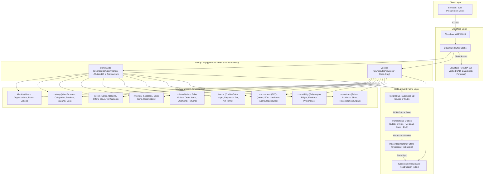

> [!WARNING]
> ARCHIVED / NON-AUTHORITATIVE
>
> This document is retained for historical/reference purposes only.
> Do NOT use this document as the current implementation specification.
>
> Current authoritative documents:
> BACKEND_PRD.md
> BACKEND_TRD.md
> BACKEND_PLAN.md
> BACKEND_INSTRUCTIONS.md
> ARCHITECTURE_DECISIONS.md
> CONTRACT_INVENTORY.md
> CONTRADICTION_REGISTER.md
> BACKEND_HANDOFF.md

# Rudrastra Technical Requirements & Architecture
**TRD v1.1 — PRD / Failure-Control Reconciliation**
**Status: FROZEN**

This document describes how the entire Rudrastra system is structurally built to enforce the requirements defined in the PRD and the failure controls defined in the Failure Control Spec.

> **Global Rule:** No technical specification may contradict `ARCHITECTURE.md`, and no application specification may redefine a cross-cutting invariant. Application documents may specialize global architecture but may not weaken it. No implementation may weaken, bypass, or reinterpret a frozen invariant without an explicit controlled revision.

---

## 1. Governance Authority Hierarchy

```text
PRD.md
    Product and operational requirements (WHAT)

docs/operations/failure_control_spec.md
    Failure prevention and control requirements (WHAT MUST NOT FAIL)

TRD.md & ARCHITECTURE.md
    Technical architecture and enforcement mechanisms (HOW IT IS GUARANTEED & STRUCTURED)

.agents/AGENTS.md
    Engineering/agent governance
```

---

## 2. Four System Planes

Rudrastra is structured across four conceptual and architectural planes:

```text
                         RUDRASTRA
                             │
        ┌────────────────────┼────────────────────┐
        │                    │                    │
   PRODUCT PLANE        COMMERCE PLANE       CONTROL PLANE
        │                    │                    │
   catalog              cart/checkout        identity
   search               orders               RBAC
   discovery            inventory             audit
   compatibility        payments              flags
        │                    │                    │
        └────────────────────┼────────────────────┘
                             │
                     OPERATIONS PLANE
                             │
       ┌───────────┬─────────┼─────────┬──────────┐
       │           │         │         │          │
    Work Mgmt   Incidents  Exceptions  Reconcile  Diagnostics
```
**Operations is not just another CRUD module.** It is the control mechanism that observes and repairs inconsistencies produced across the commerce system.

---

## 3. High-Level System Architecture & Modular Monolith



### Application Documentation Registry
Each domain is deep-dived in its respective application spec (e.g., `docs/applications/payments.md`, `docs/applications/operations.md`). `ARCHITECTURE.md` determines where everything fits; application docs determine how subsystems work in depth.

---

## 4. Cross-Cutting Global Architecture

### A. Authoritative State Ownership
Every piece of state has exactly one authoritative owner. Projections exist but are never authoritative.
* **Product identity** $\rightarrow$ Catalog
* **Seller offer** $\rightarrow$ Marketplace
* **Inventory** $\rightarrow$ Inventory
* **Order lifecycle** $\rightarrow$ Orders
* **Payment lifecycle** $\rightarrow$ Payments
* **Financial truth** $\rightarrow$ Ledger
* **Operational work** $\rightarrow$ Operations

### B. Distributed Failure Model ("Exactly-Once Illusion")
Rudrastra provides **exactly-once business effects**, not exactly-once message delivery.
`At-least-once delivery + Idempotent consumers + Unique constraints + State-machine guards + Outbox/Inbox + Reconciliation = Exactly-once business effect`

### C. Outbox / Inbox Architecture
* **Transactional Outbox**: Never publish an event after a DB update. Instead, update business state and insert an outbox event in a single database transaction. Workers publish the outbox events.
* **Inbox / Consumer Deduplication**: Every event must carry an `event_id`. Consumers must check if the event is already processed before executing side effects.

### D. Idempotency as a Platform Primitive
Applying an action multiple times must never create multiple business outcomes.
`Idempotency-Key + Operation Type + Actor/Tenant -> Idempotency Store -> Exactly one authoritative outcome`.
Must apply to checkout, payment initiation, webhooks, reservations, shipments, refunds, and operator mutations.

### E. State Machine Discipline
Arbitrary status mutation is explicitly prohibited. Valid states, transitions, preconditions, side effects, idempotency, and audit requirements must follow the canonical contract in `docs/architecture/state_machine_spec.md`.

### F. Consistency & Reconciliation Architecture
* **Temporal Consistency**: `Authoritative checkout state > Historical state > Projection state > Cached state > Search-index state`.
* **Reconciliation Engine**: Compares `Expected State` vs `Observed State` across boundaries (e.g., Payments vs Orders vs Ledger). Mismatches automatically generate Exceptions and Work Assignments in the Operations Plane.

### G. Human Mistake Defense & Privileged Actions
For privileged/dangerous actions:
`Operator -> RBAC -> Policy check -> Impact preview -> Explicit confirmation -> Idempotency check -> Mutation -> Audit -> Verification`.
Dual authorization is required for high-risk operations (e.g., massive refunds, bulk catalog edits).

### H. Universal Timeline & Correlation IDs
Every cross-system operation must carry `request_id`, `correlation_id`, `causation_id`, `actor_id`, `organization_id`, and `tenant_id` to reconstruct the entire causal chain in the Operations Plane.

### I. Inventory Concurrency Model
Inventory uses atomic reservation (via `SELECT FOR UPDATE SKIP LOCKED` or atomic conditional updates) with a TTL constraint. `available + reserved + committed <= physical stock`.

### J. Append-Oriented Ledger Architecture
Financial truth relies on immutable, double-entry ledger entries rather than mutable balances. Derived balances from ledger entries are the authoritative source of truth.

---

## 5. The 14 Architectural Invariants

These invariants enforce the Failure Control Spec controls structurally:

1. **AUTH_INV**: No protected operation may execute without server-side authorization against the current actor, organization, resource, and capability.
2. **CAT_INV**: Canonical product identity is created/mutated only by Catalog; seller offers cannot create independent physical-product identities.
3. **SRCH_INV**: Search is a derived projection and never overrides authoritative catalog state; exact MPN matching is deterministic.
4. **INV_INV**: Inventory reservations are atomic, concurrency-safe, and bounded by authoritative available quantity.
5. **CHK_INV**: Every checkout operation is idempotent and produces at most one authoritative order/payment intent outcome.
6. **PAY_INV**: Payment state is reconciled against provider state and cannot be considered final solely from asynchronous delivery assumptions.
7. **LEDG_INV**: Financial truth is represented by immutable auditable ledger entries and independently reconciled against commerce events.
8. **REF_INV**: Refund operations are bounded, idempotent, and cannot exceed refundable financial state.
9. **SLR_INV**: Seller payouts are derived from verified eligible financial state and cannot exceed the seller's payable balance.
10. **MKT_INV**: Multi-seller order aggregation preserves seller boundaries, independent fulfillment state, and financial attribution.
11. **AUD_INV**: Privileged mutations are attributable, authorized, auditable, and linked to their operational context.
12. **OPS_INV**: Any operationally significant failure must be discoverable through telemetry, exception generation, or governed work creation.
13. **DIST_INV**: Distributed operations must tolerate retries, duplication, delayed delivery, partial failure, and worker loss without creating contradictory business effects.
14. **HUM_INV**: High-risk human actions require capability authorization, impact awareness, controlled execution, and verifiable outcome.

---

## 6. Failure Control Registry Traceability

The complete, concrete 100-item failure matrix is maintained authoritatively in `docs/operations/failure_control_spec.md`. The architecture enforces these controls across 18 domains:

| Control Domain | IDs | Architectural Enforcement |
| :--- | :--- | :--- |
| Identity | AUTH-001–006 | Auth/RBAC/tenant boundary |
| Catalog | CAT-001–008 | Canonical identity/PIM |
| Search | SRCH-001–005 | Derived index/versioning |
| Inventory | INV-001–007 | Atomic reservation/state machine |
| Cart | CART-001–004 | Cart invariants/idempotency |
| Checkout | CHK-001–006 | Saga/state machine/idempotency |
| Payments | PAY-001–007 | Provider reconciliation/webhooks |
| Orders | ORD-001–005 | Authoritative state machine |
| Marketplace | MKT-001–006 | Seller-boundary model |
| Ledger | LEDG-001–006 | Immutable ledger/reconciliation |
| Seller | SLR-001–006 | Payout eligibility controls |
| Logistics | LOG-001–005 | Shipment state/reconciliation |
| Returns | RET-001–006 | Evidence/state/refund controls |
| B2B | B2B-001–005 | Organization/procurement controls |
| Operations | OPS-001–006 | Work/SLA/ownership/Reconciliation engine |
| Distributed | DIST-001–006 | Outbox/inbox/retry/recovery |
| Security | SEC-001–005 | Capability/security controls |
| Human | HUM-001–006 | Privileged-action safeguards |
