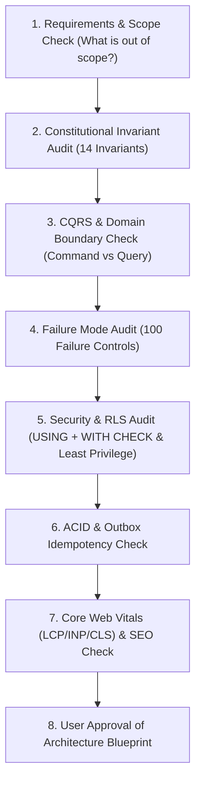

> [!WARNING]
> ARCHIVED / NON-AUTHORITATIVE
>
> This document is retained for historical/reference purposes only.
> Do NOT use this document as the current implementation specification.
>
> Current authoritative documents:
> BACKEND_PRD.md
> BACKEND_TRD.md
> BACKEND_PLAN.md
> BACKEND_INSTRUCTIONS.md
> ARCHITECTURE_DECISIONS.md
> CONTRACT_INVENTORY.md
> CONTRADICTION_REGISTER.md
> BACKEND_HANDOFF.md

# Phase 0: Requirements & Domain Invariants
**Canonical Technical B2B Marketplace + Product Information System (PIM) + Engineering Discovery Engine**

> [!IMPORTANT]
> **Product Layer Baseline**: Sourced directly from [`PRD.md`](file:///Users/praneeth/Downloads/antigravity/rudhastra%20ecomm/PRD.md) (**Rudrastra PRD v1.0 — FROZEN**).

---

## 1. Phase Objective & Engineering Scope

Phase 0 establishes the constitutional domain invariants, CQRS Command/Query rules, worker least-privilege models, and non-negotiable architectural rules that govern the **Rudrastra** platform. Every future phase, database migration, and agent implementation MUST comply with the rules defined in this document, the `failure_control_spec.md`, and the overall `ARCHITECTURE.md`.

### A. What We Are Building
* **The Core Asset**: A structured technical catalog (`manufacturers` + `catalog_products` + `product_variants`) and engineering compatibility graph.
* **The Commerce Layer**: Multi-vendor commerce (`seller_offers`, `seller_skus`, `inventory`, `orders`, `b2b_procurement`, `returns`, `ledger`) is the monetization layer.
* **Dual Identity UI**:
  * **Consumer-Facing Storefront**: Clean, light visual identity.
  * **Engineering-Facing Discovery Engine**: Dense technical specifications, compatibility trees.

---

## 2. Constitutional Domain Invariants (Hardened P0 Rules)

Every system component must satisfy these 14 Non-Negotiable System Invariants:

```text
1. AUTH_INV: No protected operation may execute without server-side authorization.
2. CAT_INV: Canonical product identity is created/mutated only by Catalog.
3. SRCH_INV: Search is a derived projection and never overrides authoritative catalog state.
4. INV_INV: Inventory reservations are atomic, concurrency-safe, and bounded.
5. CHK_INV: Every checkout operation is idempotent.
6. PAY_INV: Payment state is reconciled against provider state.
7. LEDG_INV: Financial truth is represented by immutable auditable ledger entries.
8. REF_INV: Refund operations are bounded and idempotent.
9. SLR_INV: Seller payouts are derived from verified eligible financial state.
10. MKT_INV: Multi-seller order aggregation preserves seller boundaries.
11. AUD_INV: Privileged mutations are attributable and auditable.
12. OPS_INV: Significant failures must be discoverable and generate governed work.
13. DIST_INV: Distributed operations must tolerate failures without contradictory effects.
14. HUM_INV: High-risk human actions require capability authorization and impact awareness.
```

---

## 3. Mandatory Engineering Control Flow (Architecture Review Protocol)

Before implementing any feature or schema modification, the following architecture review gate MUST be passed:

```text
Architecture cannot proceed unless:
✓ all 14 invariants have an enforcement mechanism
✓ all 100 controls have an architectural owner (100-control traceability)
✓ all critical state machines are defined
✓ all cross-domain operations have failure semantics
✓ all external integrations have reconciliation strategy
✓ all privileged actions have authorization + audit
✓ all critical data has authoritative ownership
```



---

## 4. Acceptance Criteria / Definition of Done

* [x] All 14 constitutional invariants are explicitly documented and enforced.
* [x] The "no-implementation-without-control" rule is enforced.
* [x] The distinction between Canonical Catalog and Seller Offers is enforced in all phase specifications.
* [x] All sequential phases are defined with explicit cross-phase dependencies.
