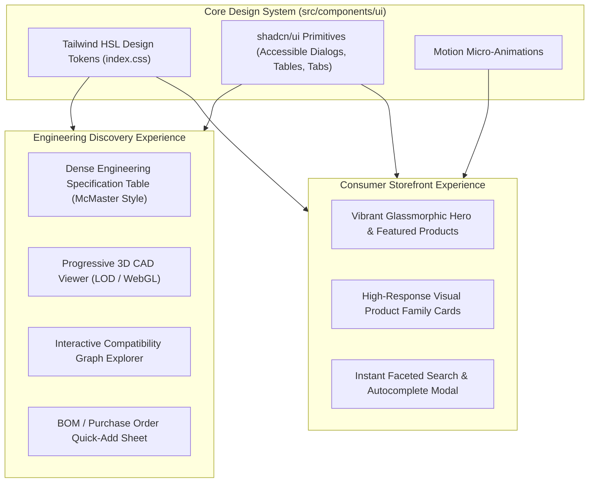

> [!WARNING]
> ARCHIVED / NON-AUTHORITATIVE
>
> This document is retained for historical/reference purposes only.
> Do NOT use this document as the current implementation specification.
>
> Current authoritative documents:
> BACKEND_PRD.md
> BACKEND_TRD.md
> BACKEND_PLAN.md
> BACKEND_INSTRUCTIONS.md
> ARCHITECTURE_DECISIONS.md
> CONTRACT_INVENTORY.md
> CONTRADICTION_REGISTER.md
> BACKEND_HANDOFF.md

# Phase 4: Design System, UI Tokens & Progressive CAD Rendering
**Canonical Technical B2B Marketplace + Product Information System (PIM) + Engineering Discovery Engine**

---

## 1. Phase Objective

Phase 4 establishes the **Dual-Identity Design System** using Tailwind CSS, `shadcn/ui`, and Motion. It resolves the visual tension between a **consumer-facing premium storefront** and an **engineering-facing discovery engine** while establishing strict performance invariants for 3D CAD rendering.

### Brand Aesthetic Guidance ("Uncover-Inspired, Not a Clone")
* **Reference Scope**: "Uncover-inspired" serves as a reference for visual density, micro-animation fluidity, typography precision, and glassmorphic depth—**not as an instruction to build an Uncover clone**.
* **Vyooma Identity**: Vyooma maintains its own unique visual language optimized for high-precision technical engineering discovery, dense specification tables, and B2B enterprise procurement.

---

## 2. Dual-Identity UI Architecture & Progressive CAD Rendering



---

## 3. Mandatory UI Design Tokens & Typography

* **Typography**:
  * Primary / UI: *Inter* or *Outfit* for modern sans-serif readability.
  * Engineering / Numeric Specs: *JetBrains Mono* or *Roboto Mono* for aligned numerical specifications, MPN codes, and GTIN strings.
* **Color System**:
  * Custom HSL color palettes supporting deep dark mode and vibrant accent gradients.
  * Distinct semantic badges for seller verification (`KYC Verified`, `Manufacturer Authorized`) and stock status (`In Stock`, `2-Day Lead Time`, `B2B Bulk Eligible`).
* **Accessibility (WCAG 2.1 AA)**:
  * Minimum contrast ratio of 4.5:1 on all text.
  * Fully keyboard-navigable tables and faceted filter drawers.

---

## 4. Progressive CAD Rendering Invariant (Hardened Rule #24)

Large 3D STEP, STL, and IGES mechanical models can exceed 50MB+, causing browser freezes, GPU crashes, and severe Core Web Vitals degradation.

```text
Product Page Load
        ↓
Lightweight Static 2D Rendering / GLB Thumbnail (0ms CAD overhead)
        ↓
User Explicitly Clicks "Open 3D Viewer" Modal
        ↓
Progressive Level-of-Detail (LOD) Stream -> WebGL Canvas
```

### CAD Invariant
* **Never load raw STEP/STL/IGES files directly into the initial product page DOM.**
* All CAD files uploaded to R2 undergo server-side conversion to optimized `.glb` Level-of-Detail (LOD) formats for web previewing.

---

## 5. Acceptance Criteria / Definition of Done

* [x] `index.css` defines custom HSL tokens, dark mode variables, and typography rules.
* [x] Consumer storefront cards and dense engineering tables co-exist within the same layout component system.
* [x] Progressive CAD rendering invariant prohibits raw STEP loading on initial page render.
* [x] WCAG 2.1 AA keyboard accessibility and contrast standards are enforced.
