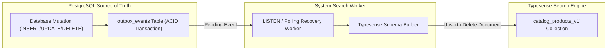

> [!WARNING]
> ARCHIVED / NON-AUTHORITATIVE
>
> This document is retained for historical/reference purposes only.
> Do NOT use this document as the current implementation specification.
>
> Current authoritative documents:
> BACKEND_PRD.md
> BACKEND_TRD.md
> BACKEND_PLAN.md
> BACKEND_INSTRUCTIONS.md
> ARCHITECTURE_DECISIONS.md
> CONTRACT_INVENTORY.md
> CONTRADICTION_REGISTER.md
> BACKEND_HANDOFF.md

# Phase 6: Search Infrastructure & Typesense Indexing
**Canonical Technical B2B Marketplace + Product Information System (PIM) + Engineering Discovery Engine**
**Architecture v1.0 — Structurally Hardened, Pending Final Consistency Audit**

---

## 1. Phase Objective

Phase 6 implements the **Typesense Read/Search Index**, synchronization workers, and engineering-specific ranking strategy. It strictly enforces P0 Commandment #2 and P1 Issue #22:
> **PostgreSQL is the sole authoritative source of truth. Typesense is a derived, disposable read index. If Typesense is destroyed, it MUST be 100% reconstructible from PostgreSQL.**

---

## 2. Unidirectional Data Synchronization Architecture



---

## 3. Multi-Layer Engineering Search Ranking & Typo Fallback (Hardened P1 Rule #14)

In an engineering discovery engine, a search for `MN4014` must rank exact part numbers above generic descriptions. Rather than relying on simple numeric weights alone, Typesense query execution operates through a **9-Layer Ranking Hierarchy**:

```text
Layer 1: Exact Identifier Match (mpn == query)
Layer 2: Normalized Identifier Match (normalized_mpn == normalize(query))
Layer 3: Exact Manufacturer + Identifier Composite Match
Layer 4: Exact Seller SKU Code Match (sku_codes)
Layer 5: Product Family Title / Name Match
Layer 6: Category Taxonomy & Specification Parameter Match
Layer 7: Full-Text Description Relevance Score
Layer 8: Availability Boost (In-Stock items prioritized)
Layer 9: Brand Verification Boost (Verified OEM +20%)
```

### Identifier Normalization & Typo Fallback Rules
* **No Silent Fuzzy Matching on Part Numbers**: Typo tolerance (`num_typos: 0`) is strictly disabled on `mpn`, `normalized_mpn`, and `sku_codes`. Searching for `A12346` will NEVER silently return `A12345`.
* **"Did You Mean...?" Secondary Suggestions**: When an exact MPN search returns zero results, the engine performs a secondary fuzzy query (`num_typos: 1`) and renders an explicit **"No exact match. Did you mean [MN4014]?"** suggestion block above textual fallback results.
* **Identifier Variant Coverage**: Search indexing and query normalization automatically strip hyphens, spaces, and casing so that `MN4014`, `MN-4014`, `mn 4014`, and `T-Motor MN4014` map canonically to `MN4014`.

---

## 4. Typesense Collection Schema (`catalog_products_v1`)

```json
{
  "name": "catalog_products_v1",
  "fields": [
    { "name": "id", "type": "string" },
    { "name": "manufacturer_name", "type": "string", "facet": true },
    { "name": "mpn", "type": "string" },
    { "name": "normalized_mpn", "type": "string" },
    { "name": "name", "type": "string" },
    { "name": "category_slug", "type": "string", "facet": true },
    { "name": "variants_count", "type": "int32" },
    { "name": "min_price_inr", "type": "float", "facet": true },
    { "name": "in_stock_flag", "type": "bool", "facet": true },
    { "name": "sku_codes", "type": "string[]" },
    { "name": "specs_kv_rpm_v", "type": "float[]", "facet": true, "optional": true },
    { "name": "specs_voltage_v_min", "type": "float", "facet": true, "optional": true },
    { "name": "specs_voltage_v_max", "type": "float", "facet": true, "optional": true },
    { "name": "specs_continuous_current_a", "type": "float[]", "facet": true, "optional": true },
    { "name": "specs_protocol", "type": "string[]", "facet": true, "optional": true }
  ],
  "default_sorting_field": "variants_count"
}
```

---

## 5. Acceptance Criteria / Definition of Done

* [x] Search index collection schema supports numerical filtering and multi-value facets.
* [x] 9-layer search ranking hierarchy prioritizes exact MPN/SKU matching over generic text.
* [x] Typo fallback renders an explicit "Did you mean...?" suggestion instead of silent fuzzy part matching.
* [x] Identifier normalization tests cover `MN4014`, `MN-4014`, and `T-Motor MN4014`.
