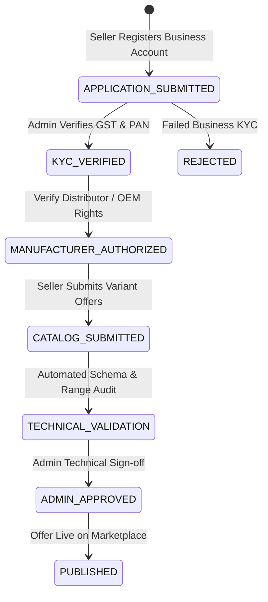

> [!WARNING]
> ARCHIVED / NON-AUTHORITATIVE
>
> This document is retained for historical/reference purposes only.
> Do NOT use this document as the current implementation specification.
>
> Current authoritative documents:
> BACKEND_PRD.md
> BACKEND_TRD.md
> BACKEND_PLAN.md
> BACKEND_INSTRUCTIONS.md
> ARCHITECTURE_DECISIONS.md
> CONTRACT_INVENTORY.md
> CONTRADICTION_REGISTER.md
> BACKEND_HANDOFF.md

# Phase 7: Sellers & Multi-Vendor Offer System
**Canonical Technical B2B Marketplace + Product Information System (PIM) + Engineering Discovery Engine**

---

## 1. Phase Objective

Phase 7 implements seller onboarding, multi-vendor commercial offers, seller SKUs, and B2B pricing models. It enforces P0 Commandments #1 and #5, and solves P1 Issues #12, #13, and #14 by guaranteeing:
* **Controlled Seller Onboarding Pipeline**: Sellers cannot publish immediately upon registration.
* **Tenant-Scoped Uniqueness**: `(seller_id, sku_code)` and `(seller_id, variant_id)` are unique per seller account.
* **B2B Bulk Pricing Architecture**: Support for MOQ, tiered price breaks, GST rates, and price validity windows.

---

## 2. Controlled Seller Onboarding State Machine



---

## 3. Drizzle Schema: Sellers, Offers & B2B Pricing (`src/modules/sellers/schema.ts`)

```typescript
import { pgTable, uuid, text, timestamp, boolean, integer, numeric, jsonb, unique } from 'drizzle-orm/pg-core';
import { sellerAccounts } from '../identity/schema';
import { productVariants } from '../catalog/schema';

// 1. Seller Offers (Commercial terms for a canonical variant)
export const sellerOffers = pgTable('seller_offers', {
  id: uuid('id').defaultRandom().primaryKey(),
  sellerId: uuid('seller_id').notNull().references(() => sellerAccounts.id),
  variantId: uuid('variant_id').notNull().references(() => productVariants.id),
  basePriceInr: numeric('base_price_inr', { precision: 12, scale: 2 }).notNull(),
  currency: text('currency').default('INR').notNull(),
  taxInclusive: boolean('tax_inclusive').default(false).notNull(),
  gstRatePercent: numeric('gst_rate_percent', { precision: 5, scale: 2 }).default('18.00').notNull(),
  leadTimeDays: integer('lead_time_days').default(1).notNull(),
  moq: integer('moq').default(1).notNull(), // Minimum Order Quantity
  // B2B Tiered Pricing Breaks: e.g. [{"minQty": 10, "priceInr": 8200}, {"minQty": 50, "priceInr": 7800}]
  priceBreaksJson: jsonb('price_breaks_json'),
  effectiveFrom: timestamp('effective_from', { withTimezone: true }).defaultNow().notNull(),
  effectiveUntil: timestamp('effective_until', { withTimezone: true }),
  isActive: boolean('is_active').default(true).notNull(),
  createdAt: timestamp('created_at', { withTimezone: true }).defaultNow().notNull(),
}, (table) => ({
  uniqueActiveSellerVariant: unique().on(table.sellerId, table.variantId),
}));

// 2. Seller SKUs (Seller internal inventory code)
export const sellerSkus = pgTable('seller_skus', {
  id: uuid('id').defaultRandom().primaryKey(),
  offerId: uuid('offer_id').notNull().references(() => sellerOffers.id),
  sellerId: uuid('seller_id').notNull().references(() => sellerAccounts.id),
  skuCode: text('sku_code').notNull(),
  barcode: text('barcode'),
  createdAt: timestamp('created_at', { withTimezone: true }).defaultNow().notNull(),
}, (table) => ({
  uniqueSellerSku: unique().on(table.sellerId, table.skuCode),
}));
```

---

## 4. Acceptance Criteria / Definition of Done

* [x] Schema enforces `UNIQUE(seller_id, sku_code)` and `UNIQUE(seller_id, variant_id)`.
* [x] B2B pricing model supports MOQ, GST rate, tiered price breaks (`priceBreaksJson`), and effective time windows.
* [x] Seller onboarding state machine prevents unverified accounts from publishing active offers.
