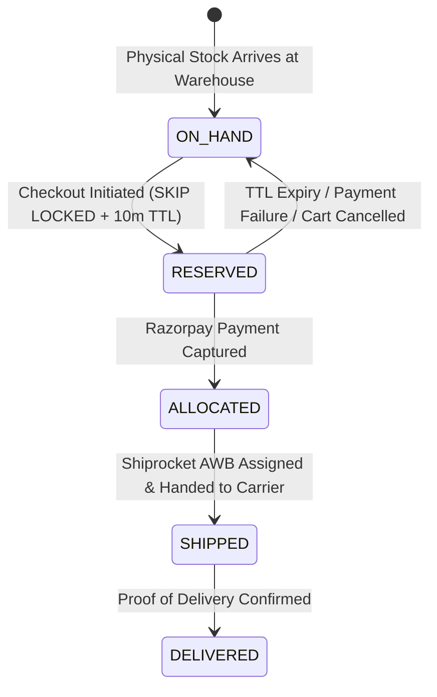

> [!WARNING]
> ARCHIVED / NON-AUTHORITATIVE
>
> This document is retained for historical/reference purposes only.
> Do NOT use this document as the current implementation specification.
>
> Current authoritative documents:
> BACKEND_PRD.md
> BACKEND_TRD.md
> BACKEND_PLAN.md
> BACKEND_INSTRUCTIONS.md
> ARCHITECTURE_DECISIONS.md
> CONTRACT_INVENTORY.md
> CONTRADICTION_REGISTER.md
> BACKEND_HANDOFF.md

# Phase 8: Cart, Inventory State Machine & Transactional Reservation
**Canonical Technical B2B Marketplace + Product Information System (PIM) + Engineering Discovery Engine**

---

## 1. Phase Objective

Phase 8 implements multi-seller shopping carts, inventory accounting, warehouse location allocation, and transactional stock reservations. It resolves P0 Issues #4 and #5, and P1 Issue #16 by enforcing:
* **Strict Inventory Accounting**: `Sellable Stock = On-Hand Stock - Reserved Stock`. Never call on-hand stock "available".
* **Multi-Location Allocation Algorithm**: Selecting the optimal warehouse location based on sellable stock and shipping SLA.
* **ACID Row-Locking Concurrency**: Using `SELECT ... FOR UPDATE SKIP LOCKED` with explicit location fallbacks and 10-minute TTL expiration.
* **Server-Verified Cart Ownership**: Carts are owned by an authenticated `user_id` or B2B `organization_id`.

---

## 2. Inventory State Machine & Allocation Strategy



### Multi-Location Warehouse Allocation Algorithm
When a buyer requests `Q` units of SKU `X`:
1. Query `inventory_items` joined with `inventory_locations` where `(on_hand_quantity - reserved_quantity) >= Q`.
2. Order candidate locations by:
   * **Priority 1**: Same state/city as buyer shipping address (lowest SLA days & freight cost).
   * **Priority 2**: Highest sellable quantity (preventing warehouse fragmentation).
3. If no single warehouse has `>= Q`, split the reservation across the top 2 warehouses if seller terms permit, or reject with a structured partial-availability error.

---

## 3. Complete Transactional Reservation SQL Pattern (`SKIP LOCKED`)

```sql
-- Multi-Location Safe Inventory Reservation Query Pattern
BEGIN;

-- 1. Locate and lock row in optimal warehouse with sellable stock >= $quantity
WITH target_item AS (
  SELECT id, on_hand_quantity, reserved_quantity
  FROM inventory_items
  WHERE seller_sku_id = $1
    AND (on_hand_quantity - reserved_quantity) >= $2
  ORDER BY 
    CASE WHEN location_id = $optimal_location_id THEN 0 ELSE 1 END,
    (on_hand_quantity - reserved_quantity) DESC
  LIMIT 1
  FOR UPDATE SKIP LOCKED
)
-- 2. Increment reserved quantity
UPDATE inventory_items AS ii
SET reserved_quantity = ii.reserved_quantity + $2,
    updated_at = NOW()
FROM target_item
WHERE ii.id = target_item.id
RETURNING ii.id AS reserved_item_id;

-- 3. Insert reservation lock record with 10-minute TTL
INSERT INTO inventory_reservations (
  inventory_item_id, cart_id, quantity, expires_at, status
) VALUES (
  $reserved_item_id, $cart_id, $2, NOW() + INTERVAL '10 minutes', 'RESERVED'
);

COMMIT;
```

---

## 4. Drizzle Schema: Carts & Inventory Reservations (`src/modules/cart/schema.ts`)

```typescript
import { pgTable, uuid, text, timestamp, integer } from 'drizzle-orm/pg-core';
import { profiles, organizations } from '../identity/schema';
import { sellerOffers } from '../sellers/schema';
import { inventoryItems } from '../inventory/schema';

// 1. Server-Owned Carts
export const carts = pgTable('carts', {
  id: uuid('id').defaultRandom().primaryKey(),
  userId: uuid('user_id').references(() => profiles.id), // Null for anonymous session
  organizationId: uuid('organization_id').references(() => organizations.id), // Null for retail
  sessionId: text('session_id'), // For guest checkouts
  status: text('status').default('ACTIVE').notNull(), // 'ACTIVE' | 'CHECKOUT_RESERVED' | 'CONVERTED' | 'EXPIRED'
  expiresAt: timestamp('expires_at', { withTimezone: true }).notNull(),
  createdAt: timestamp('created_at', { withTimezone: true }).defaultNow().notNull(),
});

// 2. Cart Items
export const cartItems = pgTable('cart_items', {
  id: uuid('id').defaultRandom().primaryKey(),
  cartId: uuid('cart_id').notNull().references(() => carts.id),
  offerId: uuid('offer_id').notNull().references(() => sellerOffers.id),
  quantity: integer('quantity').notNull(),
  createdAt: timestamp('created_at', { withTimezone: true }).defaultNow().notNull(),
});

// 3. Inventory Reservations (TTL Lock)
export const inventoryReservations = pgTable('inventory_reservations', {
  id: uuid('id').defaultRandom().primaryKey(),
  inventoryItemId: uuid('inventory_item_id').notNull().references(() => inventoryItems.id),
  cartId: uuid('cart_id').notNull().references(() => carts.id),
  quantity: integer('quantity').notNull(),
  expiresAt: timestamp('expires_at', { withTimezone: true }).notNull(),
  status: text('status').default('RESERVED').notNull(), // 'RESERVED' | 'SOLD' | 'RELEASED'
  createdAt: timestamp('created_at', { withTimezone: true }).defaultNow().notNull(),
});
```

---

## 5. Acceptance Criteria / Definition of Done

* [x] Schema models `onHandQuantity` and `reservedQuantity` without using "available".
* [x] Concurrency reservation SQL implements location-ordered `SKIP LOCKED` row locking with TTL.
* [x] Carts require server-verified `userId` or `organizationId` ownership.
