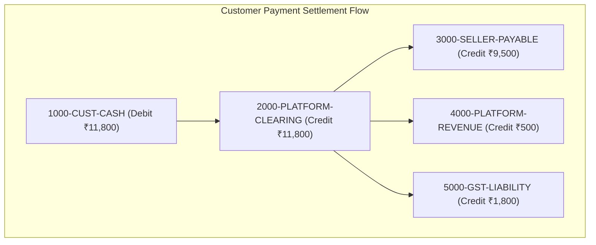

> [!WARNING]
> ARCHIVED / NON-AUTHORITATIVE
>
> This document is retained for historical/reference purposes only.
> Do NOT use this document as the current implementation specification.
>
> Current authoritative documents:
> BACKEND_PRD.md
> BACKEND_TRD.md
> BACKEND_PLAN.md
> BACKEND_INSTRUCTIONS.md
> ARCHITECTURE_DECISIONS.md
> CONTRACT_INVENTORY.md
> CONTRADICTION_REGISTER.md
> BACKEND_HANDOFF.md

# Phase 9: Checkout, Payments, Tax Engine & Double-Entry Ledger
**Canonical Technical B2B Marketplace + Product Information System (PIM) + Engineering Discovery Engine**
**Architecture v1.0 — Structurally Hardened, Pending Final Consistency Audit**

---

## 1. Phase Objective

Phase 9 implements the payment gateway abstraction, Razorpay Route multi-seller payout settlements, authoritative GST tax engine, and the **Double-Entry Capable Financial Ledger**. It resolves P0 Issues #10 and #11, and P1 Issues #9 and #14 by enforcing:
* **Expanded Payment Lifecycle State Machine**: Separating Orders, Payments, Refunds, and Settlements into independent state models.
* **Double-Entry Accounting Ledger (`DRAFT`, `POSTED`, `REVERSED`)**: `ledger_accounts` -> `ledger_transactions` -> `ledger_entries` where every transaction must satisfy `SUM(DEBITS) == SUM(CREDITS)` before being marked `'POSTED'`.
* **Immutable Accounting Ledger**: Posted transactions are strictly immutable. No `UPDATE` or `DELETE` queries are allowed; corrections occur via `'REVERSED'` compensating credit/debit entries.
* **Authoritative Checkout GST Tax Engine**: Tax calculated at checkout (`CGST`, `SGST`, `IGST`, `place_of_supply_code`) becomes authoritative for the transaction lifecycle and is permanently snapshotted into order items and addresses.

---

## 2. Double-Entry Accounting Ledger Architecture (`DRAFT -> POSTED -> REVERSED`)



### Double-Entry Invariant & Mechanical Enforcement
* Every financial movement creates a header in `ledger_transactions` (`status = 'DRAFT'`) and line items in `ledger_entries`.
* **Pre-Post Balance Verification**: Application Commands verify `SUM(amount_inr) WHERE direction = 'DEBIT'` **MUST EQUAL** `SUM(amount_inr) WHERE direction = 'CREDIT'` before transitioning `status` to `'POSTED'`.
* **No Post-Posting Edits**: A transaction in `'POSTED'` state can never be modified. To reverse an erroneous transaction, a new `ledger_transaction` with `reference_type = 'REVERSAL_TRANSACTION'` is created.

---

## 3. Authoritative Checkout GST Tax Engine

To prevent tax calculation drift between seller offers, customer orders, invoices, and ledger entries, the following authoritative flow is enforced:

```text
Seller Offer Tax Rates (cgst_rate_percent, sgst_rate_percent, igst_rate_percent)
       ↓
Checkout Tax Determination Command (evaluates buyer/seller place_of_supply_code)
       ↓
Immutable Checkout Snapshot in order_items & order_addresses (Authoritative GST amounts in INR)
       ↓
Ledger Posting & GST Liability Account Credit
```

---

## 4. Drizzle Schema: Double-Entry Ledger & Tax (`src/modules/finance/schema.ts`)

```typescript
import { pgTable, uuid, text, timestamp, numeric } from 'drizzle-orm/pg-core';
import { orders } from '../orders/schema';

// 1. Double-Entry Ledger Accounts
export const ledgerAccounts = pgTable('ledger_accounts', {
  id: uuid('id').defaultRandom().primaryKey(),
  accountCode: text('account_code').notNull().unique(), // e.g. "1000-CUST-CASH", "2000-SELLER-PAYABLE", "5000-GST-LIABILITY"
  accountName: text('account_name').notNull(),
  accountType: text('account_type').notNull(), // 'ASSET' | 'LIABILITY' | 'REVENUE' | 'EXPENSE'
  createdAt: timestamp('created_at', { withTimezone: true }).defaultNow().notNull(),
});

// 2. Ledger Transactions (Accounting Journal Header with DRAFT -> POSTED -> REVERSED states)
export const ledgerTransactions = pgTable('ledger_transactions', {
  id: uuid('id').defaultRandom().primaryKey(),
  orderId: uuid('order_id').references(() => orders.id),
  transactionDate: timestamp('transaction_date', { withTimezone: true }).defaultNow().notNull(),
  referenceType: text('reference_type').notNull(), // 'PAYMENT_CAPTURE' | 'SELLER_SETTLEMENT' | 'REFUND_DISBURSEMENT' | 'REVERSAL_TRANSACTION'
  referenceId: text('reference_id').notNull(),
  description: text('description').notNull(),
  status: text('status').default('DRAFT').notNull(), // 'DRAFT' | 'POSTED' | 'REVERSED'
  createdAt: timestamp('created_at', { withTimezone: true }).defaultNow().notNull(),
});

// 3. Ledger Entries (Double-Entry Line Items: SUM(DEBITS) MUST EQUAL SUM(CREDITS))
export const ledgerEntries = pgTable('ledger_entries', {
  id: uuid('id').defaultRandom().primaryKey(),
  transactionId: uuid('transaction_id').notNull().references(() => ledgerTransactions.id),
  accountId: uuid('account_id').notNull().references(() => ledgerAccounts.id),
  direction: text('direction').notNull(), // 'DEBIT' | 'CREDIT'
  amountInr: numeric('amount_inr', { precision: 12, scale: 2 }).notNull(),
  createdAt: timestamp('created_at', { withTimezone: true }).defaultNow().notNull(),
});
```

---

## 5. Acceptance Criteria / Definition of Done

* [x] Schema models `DRAFT`, `POSTED`, and `REVERSED` ledger transaction states.
* [x] Pre-post balance verification guarantees `SUM(debits) == SUM(credits)` before posting.
* [x] Authoritative checkout GST calculation is snapshotted into order items and addresses.
* [x] SQL privileges for `UPDATE` and `DELETE` on ledger tables are revoked for all application database users.
