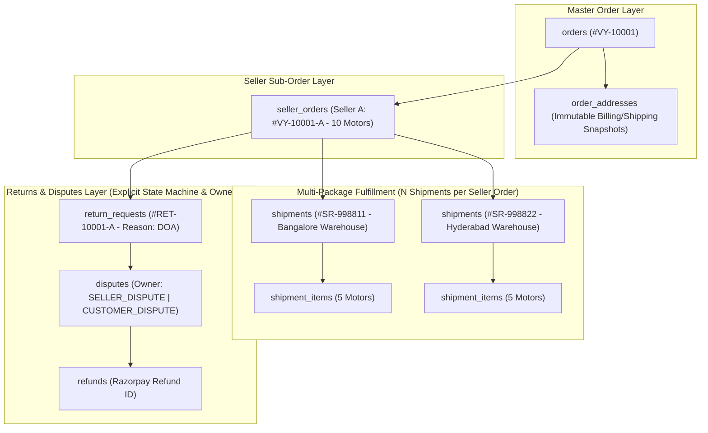

> [!WARNING]
> ARCHIVED / NON-AUTHORITATIVE
>
> This document is retained for historical/reference purposes only.
> Do NOT use this document as the current implementation specification.
>
> Current authoritative documents:
> BACKEND_PRD.md
> BACKEND_TRD.md
> BACKEND_PLAN.md
> BACKEND_INSTRUCTIONS.md
> ARCHITECTURE_DECISIONS.md
> CONTRACT_INVENTORY.md
> CONTRADICTION_REGISTER.md
> BACKEND_HANDOFF.md

# Phase 10: Orders, Multi-Package Shipments, Returns & Disputes Domain
**Canonical Technical B2B Marketplace + Product Information System (PIM) + Engineering Discovery Engine**
**Architecture v1.0 — Structurally Hardened, Pending Final Consistency Audit**

---

## 1. Phase Objective

Phase 10 implements master order orchestration, multi-seller order splitting, immutable address and item snapshots, multi-package logistics fulfillment, and the post-order **Returns, Refunds & Disputes Domain**. It resolves P0 Issues #3, #4, and #12, and P1 Issue #13 by enforcing:
* **Complete Immutable Order Snapshots**: Order items snapshot variant ID, revision number, MPN, product name, seller SKU, unit price, and GST breakdown at checkout time so historical orders never rely on current catalog or variant state.
* **Multi-Package Shipments (`seller_order -> N shipments -> N shipment_items`)**: A single seller order can split across multiple warehouse locations and logistics carriers.
* **Returns, Refunds & Disputes Domain with Explicit Ownership**: Explicit state machines and ownership models for customer disputes, seller disputes, payment disputes, and logistics disputes.

---

## 2. Multi-Seller & Multi-Package Splitting Architecture



---

## 3. Drizzle Schema: Address Snapshots & Complete Item Snapshots (`src/modules/orders/schema.ts`)

```typescript
import { pgTable, uuid, text, timestamp, integer, numeric } from 'drizzle-orm/pg-core';
import { sellerAccounts } from '../identity/schema';
import { productVariants } from '../catalog/schema';

// 1. Immutable Order Address Snapshots
export const orderAddresses = pgTable('order_addresses', {
  id: uuid('id').defaultRandom().primaryKey(),
  orderId: uuid('order_id').notNull(),
  addressType: text('address_type').notNull(), // 'BILLING' | 'SHIPPING'
  companyName: text('company_name'),
  recipientName: text('recipient_name').notNull(),
  streetAddress1: text('street_address_1').notNull(),
  streetAddress2: text('street_address_2'),
  city: text('city').notNull(),
  state: text('state').notNull(),
  pincode: text('pincode').notNull(),
  placeOfSupplyCode: text('place_of_supply_code').notNull(),
  createdAt: timestamp('created_at', { withTimezone: true }).defaultNow().notNull(),
});

// 2. Orders & Seller Orders
export const orders = pgTable('orders', {
  id: uuid('id').defaultRandom().primaryKey(),
  customerId: uuid('customer_id').notNull(),
  organizationId: uuid('organization_id'),
  orderNumber: text('order_number').notNull().unique(),
  totalAmountInr: numeric('total_amount_inr', { precision: 12, scale: 2 }).notNull(),
  status: text('status').default('CREATED').notNull(),
  createdAt: timestamp('created_at', { withTimezone: true }).defaultNow().notNull(),
});

export const sellerOrders = pgTable('seller_orders', {
  id: uuid('id').defaultRandom().primaryKey(),
  orderId: uuid('order_id').notNull().references(() => orders.id),
  sellerId: uuid('seller_id').notNull().references(() => sellerAccounts.id),
  sellerOrderNumber: text('seller_order_number').notNull().unique(),
  totalAmountInr: numeric('total_amount_inr', { precision: 12, scale: 2 }).notNull(),
  fulfillmentStatus: text('fulfillment_status').default('PROCESSING').notNull(),
  createdAt: timestamp('created_at', { withTimezone: true }).defaultNow().notNull(),
});

// 3. Complete Immutable Order Item Snapshots (Hardened Rule #10)
export const orderItems = pgTable('order_items', {
  id: uuid('id').defaultRandom().primaryKey(),
  sellerOrderId: uuid('seller_order_id').notNull().references(() => sellerOrders.id),
  variantId: uuid('variant_id').notNull().references(() => productVariants.id),
  productNameSnapshot: text('product_name_snapshot').notNull(),
  variantNameSnapshot: text('variant_name_snapshot').notNull(),
  mpnSnapshot: text('mpn_snapshot').notNull(),
  revisionNoSnapshot: integer('revision_no_snapshot').notNull(),
  sellerNameSnapshot: text('seller_name_snapshot').notNull(),
  sellerSkuSnapshot: text('seller_sku_snapshot').notNull(),
  unitPriceInrSnapshot: numeric('unit_price_inr_snapshot', { precision: 12, scale: 2 }).notNull(),
  cgstAmountInrSnapshot: numeric('cgst_amount_inr_snapshot', { precision: 12, scale: 2 }).notNull(),
  sgstAmountInrSnapshot: numeric('sgst_amount_inr_snapshot', { precision: 12, scale: 2 }).notNull(),
  igstAmountInrSnapshot: numeric('igst_amount_inr_snapshot', { precision: 12, scale: 2 }).notNull(),
  quantity: integer('quantity').notNull(),
  createdAt: timestamp('created_at', { withTimezone: true }).defaultNow().notNull(),
});

// 4. Multi-Package Shipments & Shipment Items
export const shipments = pgTable('shipments', {
  id: uuid('id').defaultRandom().primaryKey(),
  sellerOrderId: uuid('seller_order_id').notNull().references(() => sellerOrders.id),
  awbNumber: text('awb_number').unique(),
  carrierName: text('carrier_name'),
  warehouseLocationId: uuid('warehouse_location_id').notNull(),
  status: text('status').default('LABEL_CREATED').notNull(), // 'LABEL_CREATED' | 'PICKED_UP' | 'IN_TRANSIT' | 'OUT_FOR_DELIVERY' | 'DELIVERED' | 'RTO'
  createdAt: timestamp('created_at', { withTimezone: true }).defaultNow().notNull(),
});

export const shipmentItems = pgTable('shipment_items', {
  id: uuid('id').defaultRandom().primaryKey(),
  shipmentId: uuid('shipment_id').notNull().references(() => shipments.id),
  orderItemId: uuid('order_item_id').notNull().references(() => orderItems.id),
  shippedQuantity: integer('shipped_quantity').notNull(),
  createdAt: timestamp('created_at', { withTimezone: true }).defaultNow().notNull(),
});
```

---

## 4. Drizzle Schema: Returns, Refunds & Explicit Dispute Ownership (`src/modules/returns/schema.ts`)

```typescript
// 5. Return Requests & Items
export const returnRequests = pgTable('return_requests', {
  id: uuid('id').defaultRandom().primaryKey(),
  orderId: uuid('order_id').notNull().references(() => orders.id),
  sellerOrderId: uuid('seller_order_id').notNull().references(() => sellerOrders.id),
  reasonCode: text('reason_code').notNull(), // 'DOA' | 'DAMAGED_IN_TRANSIT' | 'WRONG_SKU_SHIPPED' | 'COUNTERFEIT_SUSPICION'
  status: text('status').default('REQUESTED').notNull(), // 'REQUESTED' | 'APPROVED' | 'IN_TRANSIT_RTO' | 'RECEIVED_INSPECTED' | 'REFUNDED' | 'REJECTED'
  createdAt: timestamp('created_at', { withTimezone: true }).defaultNow().notNull(),
});

export const returnItems = pgTable('return_items', {
  id: uuid('id').defaultRandom().primaryKey(),
  returnRequestId: uuid('return_request_id').notNull().references(() => returnRequests.id),
  orderItemId: uuid('order_item_id').notNull().references(() => orderItems.id),
  returnQuantity: integer('return_quantity').notNull(),
  conditionReport: text('condition_report'),
});

// 6. Disputes with Explicit Domain Ownership (Hardened Rule #11)
export const disputes = pgTable('disputes', {
  id: uuid('id').defaultRandom().primaryKey(),
  orderId: uuid('order_id').notNull().references(() => orders.id),
  sellerOrderId: uuid('seller_order_id').notNull().references(() => sellerOrders.id),
  disputeOwner: text('dispute_owner').notNull(), // 'CUSTOMER_DISPUTE' | 'SELLER_DISPUTE' | 'PAYMENT_DISPUTE' | 'LOGISTICS_DISPUTE'
  disputeType: text('dispute_type').notNull(), // 'CHARGEBACK' | 'QUALITY_DISPUTE' | 'SHORT_SHIPMENT' | 'RTO_DAMAGE'
  status: text('status').default('OPEN').notNull(), // 'OPEN' | 'UNDER_INVESTIGATION' | 'RESOLVED_BUYER' | 'RESOLVED_SELLER'
  createdAt: timestamp('created_at', { withTimezone: true }).defaultNow().notNull(),
});
```

---

## 5. Acceptance Criteria / Definition of Done

* [x] `order_items` snapshots variant ID, revision number, MPN, product name, seller SKU, unit price, and GST amounts.
* [x] Schema models explicit dispute ownership (`CUSTOMER_DISPUTE`, `SELLER_DISPUTE`, `PAYMENT_DISPUTE`, `LOGISTICS_DISPUTE`).
* [x] A single `seller_order` can fulfill via `N` shipments (`shipment_items`).
* [x] All status transitions are governed by CQRS state machines in `src/modules/*/domain/`.
