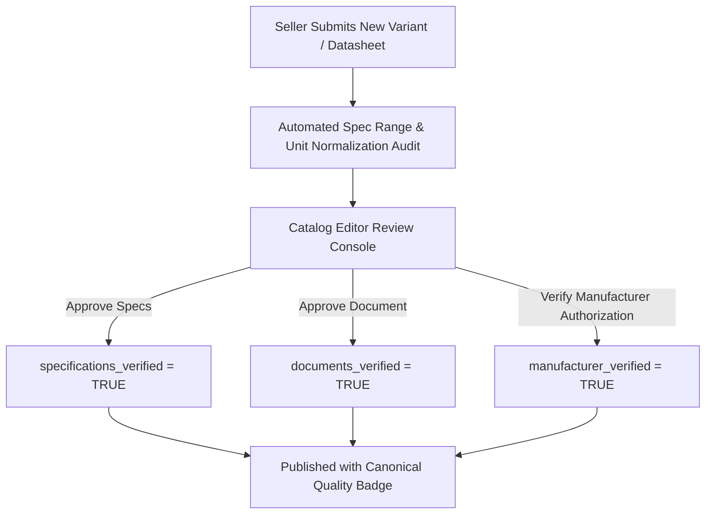

> [!WARNING]
> ARCHIVED / NON-AUTHORITATIVE
>
> This document is retained for historical/reference purposes only.
> Do NOT use this document as the current implementation specification.
>
> Current authoritative documents:
> BACKEND_PRD.md
> BACKEND_TRD.md
> BACKEND_PLAN.md
> BACKEND_INSTRUCTIONS.md
> ARCHITECTURE_DECISIONS.md
> CONTRACT_INVENTORY.md
> CONTRADICTION_REGISTER.md
> BACKEND_HANDOFF.md

# Phase 12: Admin Moderation, Catalog Quality & Verification Console
**Canonical Technical B2B Marketplace + Product Information System (PIM) + Engineering Discovery Engine**

---

## 1. Phase Objective

Phase 12 implements the internal admin moderation console and catalog verification engine. It protects the core moat—**trust in the technical data**—by enforcing:
* **Human-in-the-Loop AI Verification**: All AI-extracted datasheet specifications require explicit Catalog Editor approval.
* **Granular Verification Badges**: Distinct verification flags for manufacturer identity, specifications, documents, and compatibility edges.
* **Automated Deduplication & Cleanup**: Detecting and merging duplicate manufacturer or MPN submissions.

---

## 2. Admin Verification Workflow & Quality Badges



---

## 3. Drizzle Schema: Verification Tracking (`src/modules/catalog/verificationSchema.ts`)

```typescript
import { pgTable, uuid, text, timestamp, boolean, jsonb } from 'drizzle-orm/pg-core';
import { catalogProducts } from './schema';
import { profiles } from '../identity/schema';

// 1. Catalog Quality Verification Audit Log
export const catalogVerifications = pgTable('catalog_verifications', {
  id: uuid('id').defaultRandom().primaryKey(),
  productId: uuid('product_id').notNull().references(() => catalogProducts.id),
  verifiedBy: uuid('verified_by').notNull().references(() => profiles.id), // Catalog Editor profile
  manufacturerVerified: boolean('manufacturer_verified').default(false).notNull(),
  specificationsVerified: boolean('specifications_verified').default(false).notNull(),
  documentsVerified: boolean('documents_verified').default(false).notNull(),
  compatibilityVerified: boolean('compatibility_verified').default(false).notNull(),
  verificationNotes: text('verification_notes'),
  sourceCitationUrl: text('source_citation_url'), // Link to official OEM datasheet
  createdAt: timestamp('created_at', { withTimezone: true }).defaultNow().notNull(),
});

// 2. Duplicate Detection & Merger Audit
export const catalogMergeLogs = pgTable('catalog_merge_logs', {
  id: uuid('id').defaultRandom().primaryKey(),
  mergedBy: uuid('merged_by').notNull().references(() => profiles.id),
  sourceProductId: uuid('source_product_id').notNull(), // Deprecated product ID
  targetProductId: uuid('target_product_id').notNull().references(() => catalogProducts.id),
  reason: text('reason').notNull(),
  createdAt: timestamp('created_at', { withTimezone: true }).defaultNow().notNull(),
});
```

---

## 4. Acceptance Criteria / Definition of Done

* [x] Schema records 4 distinct verification flags (`manufacturer_verified`, `specifications_verified`, `documents_verified`, `compatibility_verified`).
* [x] AI extraction pipeline requires human Catalog Editor sign-off before publishing.
* [x] `catalog_merge_logs` tracks deduplication of redundant manufacturer MPNs.
