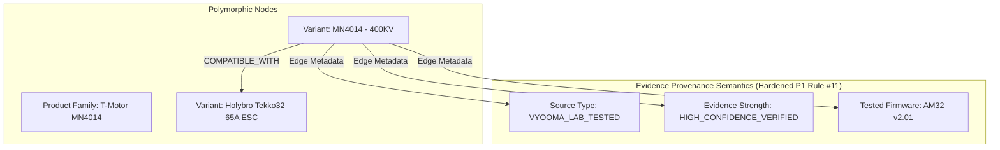

> [!WARNING]
> ARCHIVED / NON-AUTHORITATIVE
>
> This document is retained for historical/reference purposes only.
> Do NOT use this document as the current implementation specification.
>
> Current authoritative documents:
> BACKEND_PRD.md
> BACKEND_TRD.md
> BACKEND_PLAN.md
> BACKEND_INSTRUCTIONS.md
> ARCHITECTURE_DECISIONS.md
> CONTRACT_INVENTORY.md
> CONTRADICTION_REGISTER.md
> BACKEND_HANDOFF.md

# Phase 13: Engineering Compatibility Graph & Evidence Provenance Semantics
**Canonical Technical B2B Marketplace + Product Information System (PIM) + Engineering Discovery Engine**

---

## 1. Phase Objective

Phase 13 implements the engineering compatibility graph and constraint recommendation engine. It resolves P1 Issues #10, #11, and #15 by enforcing:
* **Polymorphic Entity Connection**: Compatibility edges link Product Families (`catalog_products`), specific Variants (`product_variants`), or commercial Offers (`seller_offers`).
* **Application-Level Polymorphic FK Integrity**: Because PostgreSQL cannot natively enforce foreign keys across polymorphic target columns, application-level invariants and Drizzle transaction checks guarantee reference validity.
* **Evidence Provenance Semantics**: Replacing arbitrary numerical percentages with structured evidence types (`evidence_strength`, `source_type`, `tested_firmware`).

---

## 2. Polymorphic Compatibility Graph ERD & Evidence Semantics



---

## 3. Drizzle Schema: Compatibility Graph with Evidence Provenance (`src/modules/compatibility/schema.ts`)

```typescript
import { pgTable, uuid, text, timestamp } from 'drizzle-orm/pg-core';
import { profiles } from '../identity/schema';

// 1. Polymorphic Compatibility Graph Edges
export const compatibilityEdges = pgTable('compatibility_edges', {
  id: uuid('id').defaultRandom().primaryKey(),
  sourceEntityType: text('source_entity_type').notNull(), // 'PRODUCT_FAMILY' | 'PRODUCT_VARIANT' | 'SELLER_OFFER'
  sourceEntityId: uuid('source_entity_id').notNull(),
  targetEntityType: text('target_entity_type').notNull(), // 'PRODUCT_FAMILY' | 'PRODUCT_VARIANT' | 'SELLER_OFFER'
  targetEntityId: uuid('target_entity_id').notNull(),
  relationType: text('relation_type').notNull(), // 'COMPATIBLE_WITH' | 'REQUIRES' | 'RECOMMENDED_WITH' | 'REPLACEMENT_FOR' | 'SUCCESSOR_OF' | 'INCOMPATIBLE_WITH'
  
  // Evidence Provenance Semantics (Replacing ambiguous confidence percentages)
  sourceType: text('source_type').notNull(), // 'OEM_CLAIM' | 'VYOOMA_LAB_TESTED' | 'COMMUNITY_REPORT'
  evidenceStrength: text('evidence_strength').default('UNVERIFIED_CLAIM').notNull(), // 'UNVERIFIED_CLAIM' | 'DOCUMENTED_OEM_CLAIM' | 'HIGH_CONFIDENCE_VERIFIED' | 'DISPUTED'
  sourceDocumentId: uuid('source_document_id'),
  verifiedBy: uuid('verified_by').references(() => profiles.id),
  verificationStatus: text('verification_status').default('UNVERIFIED').notNull(), // 'VERIFIED' | 'UNVERIFIED' | 'DISPUTED'
  testedConfiguration: text('tested_configuration'), // e.g., "6S Lipo, 16x5.5 Carbon Prop"
  testedFirmware: text('tested_firmware'), // e.g., "ArduCopter 4.4.1 / BLHeli_32 v32.9"
  verifiedAt: timestamp('verified_at', { withTimezone: true }),
  createdAt: timestamp('created_at', { withTimezone: true }).defaultNow().notNull(),
});
```

---

## 4. Acceptance Criteria / Definition of Done

* [x] Schema supports connecting product families, variants, or offers (`sourceEntityType`, `targetEntityType`).
* [x] Application-level polymorphic FK integrity validation is explicitly documented.
* [x] Evidence semantics (`evidenceStrength`, `sourceType`) replace arbitrary numerical percentages.
